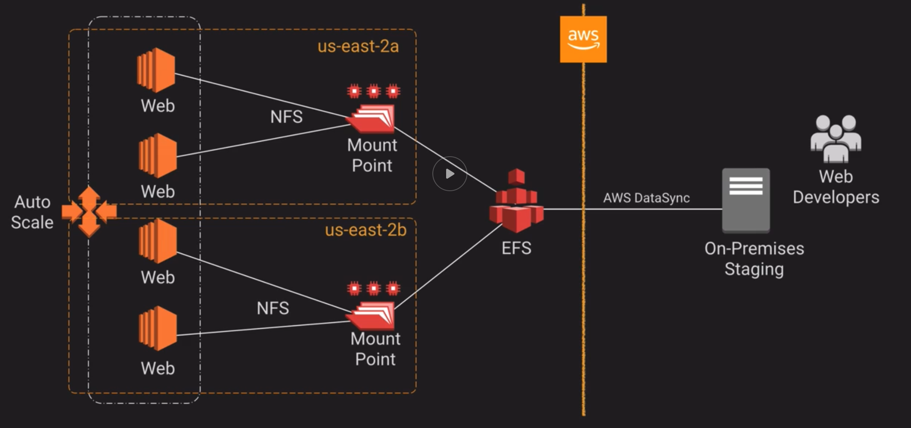

# AWS Stuff

- **Principal** is a person or application that can make authenticated or anonymous request to perform an action on a system. **Often seen in-code in lambda authorizers**

* Security **in the cloud** is **your job**

- Security **of the cloud** is the **AWS job**

- **AZ (Availability Zone)** is a distinct location within an AWS Region. Each
  Region comprises at least two AZs

* **AWS Region** is a geographical area divided into AZs. Each region counts as
  **separate** geographical area.

- **Virtual Private Cloud (VPC)** is a virtual network dedicated to a single AWS
  account. It's logically isolated from other virtual networks in the AWS cloud

* **EFS and S3** are popular storage options

- **Cloudfront** is a CDN

### Throughput vs IOPS

- **throughput** is a measurement of a **number of bits written / read per second**

* **IOPS** is a measurement of a **number of read / write operations per second**

### Lambda

- **LAMBDA IS HA by default! MULTI-AZ!**

* **scales automatically** (can run functions concurrently)

- **YOU CAN ATTACH SECURITY GROUP TO A LAMBDA**

* lambdas **inbound connections are blocked**. When it comes to outbound, **outbound TCP/IP and UDP/IP sockets are supported**.

* by default **lambda is within so called "No VPC" mode**. This means that (actually quite logically) it **will not have access to resources running within private vpc**.

#### Execution Role

- this the **role assumed by lambda when invoked**

#### Resource Role

- **lambda** is **treated as a resource** so you can grant **resource-based policy to it**.

* this is **especially useful** when **wanting to grant other account permissions to invoke your function**

#### Provisioned Concurrency

- you have to have a **function version** or an **alias that DOES NOT point to \$latest** to turn it on.

* it will basically **keep concurrently X clones of your function ready** thus making cold starts obsolete.

- can be **autoscalled by using Application AutoScaling**. Do not mistake this with auto scaling groups.

#### Inside VPC

- **YOU CAN PLACE LAMBDA INSIDE A VPC SUBNET**. The **subnet HAS TO BE PRIVATE though**. If you want to make sure that your lambda within VPC can access internet **place NAT gateway within your public subnet**. This is because lambdas have ENI assigned that never gets public IP.

#### Monitoring

- **CloudWatch metrics** are **somewhat limited**. They only include **info about errors, invocations, duration etc**.

* to see the **memory, checkout CloudWatch logs**. There is the **max-memory used**. This setting can help you to decide if your lambda needs more memory.

- you can **use XRay for distributed tracing**.

#### Lambda @ Edge

- **CloudFront will invoke your function when given event happens**. These are **events that has to do with request life-cycle @ CloudFront like origin request or smth like that**.

* you can use it to **perform A/B testing, since you can mutate the request send by the user**

- you can also **perform some redirect logic , maybe check auth**.

### Step Functions

- **state machines as a service**

* for **orchestrating serverless workflows**

### IAM

> IAM allows you to manage users and their level of access to the AWS Console

- **IAM** is universal, **is global**, does not apply to regions

* **Identity Federation** allows your users to login into AWS Console using 3rd
  party providers like Google etc..

- Supports **PCI DSS** framework. This is some kind of standard for security

- **describe** means **to be able to view, inside the console**.

* **Policies = Permissions**, written in JSON

- **Roles** enable one AWS service do something / interact with another. For
  example virtual machine (EC2) interacting with AWS storage.

* **Root Account**: email address you first sign up to AWS with. This account
  basically has a godmode and can do everything in the console. That's why you
  pretty much never want someone to login on root account, just like in Linux.

- Users can have **programmatic access** to AWS console. This basically allows
  you to pass access key and secret key so that you can interact with developer
  tools

* Users **can be added to groups**. These groups **can have policies** assigned
  to them.

- Policies have **different types**. Like `Job function` or `AWS managed`.

* **explicit deny ALWAYS overrules ALLOW**. This is very important, especially when working with groups.

#### Real Identities

- both **user and roles** are known as real identities. They both have **ARN** and **can be referenced in other areas of AWS**

* **groups ARE NOT REAL IDENTITIES**. You cannot login onto the group and such. This is such an organizational being.

#### Roles

- **not something you log into**. It does not have username, password or any kind of long-term credentials.

* you should **prefer attaching roles** instead of using aws credentials

- roles can be attached to many services

* roles can be used **in any region**, they are universal

- **roles have underlying policies, which have the notion of the Effect (allow/deny)**

* **policies** are **associated with roles**

- allows you to set **Authentication attributes**: **Usernames, passwords, Access Keys, MFA and Password Policies**

* **authentication** is the process there **you are being verified for being you, being that entity you present yourself as**

#### Assuming Roles

- role which you can assume has two segments
  - **trust policy**. This defines **who can assume a role**
  - **policy document**. This is a standard policy

* **trust relationship** is **ONLY checked** when **assuming a role** (that usually happens once or infrequently)

* assuming a role means **being a completely different identity, defined by assumed role**

- under the hood **assuming a role means using completely new, temporary, credentials created with sts which are associated with the assumed role**

* **all roles that could be assumed are automatically assumed**

- **by default** newly created User has **implicit DENY** on all services. **You should assign roles to lift the implicit deny**

* **assumed credentials** are **valid until the expiration date expires**

##### Revoking Sessions

Since removing a policy from a role which is assumed can be destructive there is another way of removing assumed (short-term) credentials. That is **revoking a session**. This basically **ads a deny all policy for tokens granted before given date**. So you did not remove the permissions directly, only invalidated given tokens. Pretty sweat!

##### Assuming cross account role

##### Assuming EC2 Role

You have to assign a role to a given instance. Then you can ssh into that instance and do stuff that that role allows you to do. This is possible because the `aws-cli` is able to obtain the short term credentials that the role provides. This is done by **querying an instance metadata role**.
`http://169.254.169.254/latest/urity-credentials/NAME_OF_THE_ROLE`

#### Policies

- **applied** to a **IAM Role or a Resource**

* have a **Sid**. This is **basically just a description** of the policy.

- **explicit deny** always **overrides explicit allow**

* **inline policies** should only be applied to a single user. They **should not** be used to **applying policies to multiple identities**. You should **use managed / custom policies for that!**.

- always **prefer explicit deny no matter what**. Use **conditions if necessary**.

##### Resource Policy

Now we are in the domain of a given service / resource.

- **IAM is not involved here**, control is **handled by a given service / resource**

##### Conditions

- you can create elaborate conditional logic for a given policy

An example for s3-prefix (folder)

```json
{
  "Condition": { "StringLike": { "s3:prefix": ["testuser/*"] } }
}
```

- you can use **variables** within IAM policies

```json
{
  "Condition": { "StringLike": { "s3:prefix": ["${aws:username}/*"] } }
}
```

#### Inline vs Managed Policies

- **inline policies** can only be **used by one entity at the time**. You **cannot reuse the same inline policy for multiple identities (can be groups), you would have to create a new one, even if it's the same**.

* **managed policies can be applied to multiple identities at once**. There are 2 versions of managed policy: **customer managed policy** and **aws managed policy**.

#### Resource Based Policies

- these are **special subset of policies** which are **attached to AWS Services**

* they have **Principal field**. This is due to the fact that they are evaluated whenever some principal access given resource. IAM role / group policies does not have that because they are applied to principals from the beginning.

#### Groups

- **CANNOT BE NESTED**. Though the **nesting is not necessary a good idea**. The **explicit deny** can sometimes **override explicit allow**. So in general the nesting should be avoided.

* they are **not a true identities**. A **virtual construct** to **help** you **manage your users**.

- you **can attach policies to them**

* you **CANNOT attach RESOURCE policies to them since they are not a true identity**.

- they are **not allowed to assume IAM Roles**

#### Users

- **UP TO 5000 IAM Users**

#### Certs

- this is a **legacy way of keeping certs**, before ACM was introduced.

* sadly **you cannot migrate IAM certs to ACM directly**. You would have to **download them** and then **import to ACM**.

### AWS Organizations

- **all accounts under organization** can **consolidate their bills** so that you have one **master bill, sum of all small bills**

* there can only be **one master account within organization**. The master account **CANNOT be restricted**

- there can **only be one Root container**.

* the **root container** can only be **controlled by master accounts and Service Control Policies**. If such controls are in place ,they apply to all OUs under the root and all member accounts under given OUs. **Root container / node** is the **account that has OUs underneath**.

- when using **consolidated billing** you can get **volume discounts**. For some **services like S3, EC2**, the more you use them (the volume of data you hold), the less you pay. This is ideal scenario for consolidated billing since all the usage adds up from your other accounts.

* you **can attach SCPS to master account** but **there will be no effect on master account**. As a good practice your master account should not hold any kind of resources.

#### Invites

- can be send **through the console or a CLI**.

* you need to have **email or accountID**

- only **one account can join one organization**

* **invitation expire** after **15 days**

- there is a **limit** on how many **invites you can send per day (20)**

* invitations can be **created by any account** as long as **the account has correct IAM permissions**

- you **cannot resend the invitation**. You have to **cancel the previous one, send the new one**

#### SCPS

- **by default** the **root account has FullAWSAccess SCP attached**

* they **do not really provide access**. They **restrict what you can do when you HAVE permissions**. Think of them as **boundaries**.

- can be used as **blacklist** or a **whitelist**.

* the **policy evaluation process** is as follows: first you take your iam permissions then you take SCPs. You **take union of permissions from your IAM and SCP, these are the permissions you effectively have**.

- you can have **multiple SCPs which apply**. In such case you take **union of every SCPs with your IAM permissions**.

#### OUs

- there are units called **Organization Units (OU)**. They **can host member accounts or other OUs**. At the top of the **OUs hierarchy there is root container**.

* can **only have one parent**

- an AWS **account can only be a member of one OU**

* you can **move account OUT of OU**. This is useful when wanting to delete an OU.

#### All features

- this is a **free feature**.

* normally, by default only **consolidated billing is `turn on` per se**. There is also **all features mode**.

- the all features mode **can be enabled on a existing organization**.

* this mode **enables you to create Service Control Policies (SCPs)**. These, as described above, allow you to place restrictions on given OUs, member accounts or a root container.

- this is **one way change**. When you enable this **you cannot switch back to only consolidated billing**.

#### Organization Activity

- this is where you can **see which services are used by accounts within Organization**.

* **DO NOT** mistake this for AWS Config. Remember - AWS Config is for looking up different configurations on stuff and checking if they are meeting some requirements

### ACM

- provides **x509 certs (SSL/TSL)**

* only **supported for services that are integrated**.

- you are **not paying for using the certs themselves**

* there are **two types of validation of the domain**. You can either **validate by DNS** or **by email**. With **DNS validation and Route53** you can easily **add DNS record through the console (not automatic)**

- uses **KMS under the hood for keys**

* can **automatically renew certs** BUT only **those which were not imported**.

### AWS Support Plans

- **developer**: for testing and experimenting with AWS

* **business**: small companies, actually using AWS in production

- **enterprise**: for mission critical and big companies

* **only business and enterprise** come with **full checks for trusted advisor**.

- **business and enterprise** allow you to have **programmatic(API) access to AWS Support APIS**

* **business** gives you **access to TAM - Technical Account Manager**.

### AWS Config

- so CloudTrail monitors API calls to AWS services (made by your account). AWS Config **monitors your AWS resources configurations**.

- you have too **tick additional checkbox** to **support monitoring global services (not only in a given region)**

* with AWS Config you can have **history of given resource configurations**

- saves config snapshots to a bucket

* you can **traverse resource configuration over time**.

- you can **create rules**. There are **predefined(AWS) rules** or you can create **custom rules**. With this you can for example see if someone enabled inbound port on security group which you deemed non-compliant.

* keep in mind that this tool **is NOT used for restricting anything. It merely watches over your resources over-time**

### System Manager

- helps you manage **large landscapes** like **100s of instances**

* **agent installed by default on modern AMIs**, can also be **downloaded and installed on-prem**

- you have **inventory** which **collects OS, application and instances metadata (about instances)**

* **parameter store** where **you can store config data, connection strings etc.**. **Can be integrated** with **Secrets Manager**.

- **create maintenance windows** for multiple instances. You can run scripts and such.

### AWS Service Catalog

- **describes** all **services you offer**. Very **much like online store** but instead of buying eg. food **someone buys products you provide**.

* **region aware** service.

- even if you as a user do have a readonly access to aws, you would still be able to deploy a product from a portfolio if the provider provided deploy permissions on portfolio.

* since the **user is interacting with parameters from CloudFormation**, you as an portfolio admin can **place constrains on those parameters**, like you can only deploy on t2.micro or t3.large or smth like that.

### Access Advisor

- will tell you **what services have the user access to** and also **when he accessed them**. This is a tab within IAM users console

### AWS For Enterprise

#### Workspaces

- gives you **access to a remote workstation**. You can ssh into a machine and do stuff.

* **can be placed within a VPC**. When you restrict the outbound you have created pretty secure environment.

#### AppStream

- gives you **access to a single application (a program)** which usually cost much.

* **can be placed within a VPC**. When you restrict the outbound you have created pretty secure environment.

#### AWS Connect

- basically a **call center with routing**.

#### Chime

- basically **the same as Google Hangouts**

### Sage Maker

- **analyze ML data and develop the models**

* you can use **AWS managed Algorithms**

### S3

> S3 stands for **Simple Storage Service**

- S3 is an **object storage**, it allows you to upload files.

* Data is spread between multiple devices and facilities

- There is **unlimited** storage. Maximum file-size is 5 TB though.

* **S3 IS NOT A GLOBAL SERVICE**. It has a universal namespace but the **data stays in the region you created the bucket in (unless you specified CRR**.

* By **default** uploaded objects **are NOT public**. You have to set them as public manually

- **if amount of reads/writes is high** consider adding **logical or sequential naming to your S3 objects**. Amazon rewrote the partitioning mechanism for S3 and it does not longer require random prefixes for performance gains

* S3 has an **universal namespace**. That means that Bucket names has to be
  unique globally.

* Object consists of:

  - Key: simply the name of the object
  - Value: data (bytes)
  - Version ID: **S3 allows you to have multiple versions of a file**
  - Metadata
  - Sub-resources

- Buckets can be **replicated to another account or to a different bucket
  (region needs to differ)**.

* S3 can be `accelerated`. There is something called **S3 Transfer Acceleration** where users upload to **edge locations** instead directly to
  the Bucket. Then that uploaded object is **transferred automatically to your
  bucket**.

- S3 is a **tiered** storage

  - **S3 Standard**, stored across multiple devices and multiple facilities. **Standard can tolerate AZ failure**

  - **S3-IA/S3 One Zone-IA** (**Infrequent Access**): for data that is accessed less
    frequently but requires rapid access when needed

  - **S3 Glacier / Glacier Deep Archive**: used for data archiving, where you would
    keep files for a long time. Retrieval time is configurable (**Deep
    Archive is locked on 12hr retrieval time though**)

  - **S3 Intelligent-Tiering**: this is **great for unknown or unpredictable access patterns**. Will **automatically place** your files in **most optimized storage option**. There is a **monthly cost for using this option**

- **tiers** apply to **object**, **not a bucket!**

#### Glacier

- **Glacier / Glacier Deep Archive** is an **immutable store**. That means that you cannot edit stuff once it's there.

* **Glacier/Deep Archive** have something called **expedited retrieval**. This allows you to **get the data from glacier and not wait Days/hours/Months**. There is a catch though. The **expedited retrieval** is **using resources from shared pool of resources**. There might a case there those resources are unavailable. This is where **provisioned glacier capacity** is used. This **ensures that your expedited retrieval request will not be rejected**. But you have to **pay more (additionally for it)**

- **S3 NON-Glacier** supports **object-lock**. This **along with versioning allows for immutable objects**, but you **have to specify the amount of time the lock thingy is present**.

* **used** by **virtual tape library** (underneath)

- there exists a concept of **glacier vault**. You can think of the vault as a **bucket in it's own rights**.

* **glacier vault** can be given **access by using IAM roles**.

- you can create **vault archives UP to 40 tb** (this is usually a .zip file).

##### Vault Lock

- you have **24hrs** after creation **to confirm that the lock you created meets your requirements**. If that's not the case **you can abort it** or **complete it**.

* vault lock is **immutable**. You **cannot change it**. You can either **destroy it or create a new one**.

- you can **attach vault lock policies to the vault** eg. nobody can delete anything out of it (or use MFA). This is mainly used for **compliance controls and tightening restrictions on data access**. This is useful for **preventing deletes and such**

#### Consistency

- **strong consistency Read after Write** for **PUTS**. Basically you can read immediately after
  you write to a bucket

- **Eventual Consistency** for **overwrite PUTS and DELETE**. Basically if you
  delete something or override it, it takes a second or two for you changes to
  propagate and take an effect.

* **updates to a single key** are **atomic**. Only one person can update given object at given point of time.

#### Consistency Gotchas

- **404 get, upload, then get** will **result in eventual consistency**. This is due to **how internals of s3 work**. It seems like there is **some cache involved**.

#### Limits

- maximum of **5TB for a single file**

* maximum of **5GB for a single upload** (use **multipart upload**)

#### Versioning

- S3 have the notion of versioning: **stores all versions of an object including all writes even if you delete it!**

* After **enabling** versioning, it **cannot be disabled**, only **suspended**

- Remember that with versioning your previous versions persists on the bucket. This can lead to exponential growth of size when editing big files.

* When an object is deleted, **bucket may seem empty** but that's not the case. You just placed a _delete marker_ on that object (thus creating a new version). Your **previous versions are still there!, you can view them within versions tab!**.

- You can restore your deleted objects by **deleting a delete marker**.

* **you are still billed for old versions**. Event though there might a delete marker the object is not permanently deleted so you have to pay for the storage.

#### Life-cycle rules

- can be used to **transition objects to different TIER of storage after X amount of time**, this can be placed on current and previous versions.

* With life-cycle there is notion of expiration. Basically your objects can be **expired after X amount of time**. Object can be in a _expired state_ where it will wait to be permanently deleted.

- Can be used with **conjunction with versioning**.

* **once placed in a tier, life-cycle rules will not be able to place the item back a tier (where it was)**

- they **apply** to **buckets, prefixes, tags and current or previous versions of the object**.

#### Storage Gateway

- **SOMETHING YOU DOWNLOAD**

* Physical/virtual device which **will replicate your data to AWS**.

- There are 3 flavours of Storage Gateway
  - **File Gateway** : used for storing files as object in S3 - **NFS, SMB** .
  - **Volume Gateway**: used for storing copies of hard-disk drives in S3 - **iSCSI**.
  - **Tape Gateway**: used to get rid of tapes - **iSCSI**, for use mainly with **backup software**.

* With **Volume Gateway** you can create **point-in-time backups as EBS snapshots**

- if you see **ISCSI** that is **probably Volume Gateway**.

* remember that **if the consumer wants ALL his data in S3, you should NOT use cached volume**. This is because with cached volume only your primary data is written to s3.

- **useful** when doing any kind of **cloud migrations**

##### File Gateway

- **exposes itself as NFS**

#### Security

- **by default only the account that created the bucket can do stuff with it**

* when you want to assign policies to the resources you do not control, you should be using **resource policies**, in this case know as **bucket policies**. This policies **apply to any identities accessing this bucket**.

- **ACLs are legacy!**. They are attached to bucket or an object. Mainly used for **granting log delivery**.

* you would use **identity policies** to **control access** to s3 resources, this however **only works on identities IN YOUR ACCOUNT!, identities you control**.

- using **resource policy** you can **control access** to s3 resources, works on **identities you DO NOT control. THIS ALSO MEANS ANY IDENTITY**. When resource policy is used **specifically with s3**, it is known as **bucket policy**

* you can enable **Server access logs** for S3. This will **provide you with detailed records for the requests made to the bucket**

- with **Server access logs** you can **write access logs to a different bucket**. Remember to **give Log Delivery group permissions to write to dest. bucket!**.

* **bucket policies** and **ALC** suffer from the fact that **usually, the uploader is the owner of the object**. Imagine giving someone permissions to upload (from another account eg.) and then you cannot delete that file. **You can guard against that** by **creating resource policy** where you **deny any requests when full permissions were not granted to the owner while uploading given object**.

So when to use what?

- _identity policy_
  - when **you control the identity**. That means **identities within your account**.

* _bucket policy_ (resource policy)
  - when **you DO NOT control the identity**

- by **exposing a role which can be assumed** by third party you are **making sure that YOU as a bucket owner stay as the owner of a given object**. This is why you would want to use _bucket policies_ when you do not control the identity.

* **pre-signed urls** work **per object level**

- **pre-signed urls** always **have the permission of the identity that signed the URL**. They **expire** or can be **made useless sometimes, when the permissions of signing identity changed**

#### Encryption

- **PER OBJECT** basis

* there are multiple options:
  - **SSE-C**: **keys** are **stored by the customer**. It does **not allow for role separation**. **You manage the AWS master key**.
  - **SSE-KMS**: **keys** are **managed by KMS service**. It **allows for role separation** since **keys are stored in accounts KMS**
  - **SSE-S3**: The **master key is within AWS**.

- **no additional cost** for enabling encryption

* there is something called **default encryption**. This will ensure that every object you put into a bucket will get encrypted. **You can use AES-256 or KMS**.

- remember that **encryption only applies to objects uploaded AFTER the encryption was turned on**. Existing objects are NOT encrypted.

* you can **override the default encryption PER object basis when uploading**.

##### SSE-S3

- **objects encrypted by S3 using KMS on your behalf**

* **keys** are **stored on the objects themselves**. If you have permission to read the object you can decrypt it

##### SSE-KMS

- **objects encrypted using individual KMS keys**

* **keys are stored within S3 object**

- **decryption of the objects** requires you to have **both iam permissions for the S3 operation and the KMS key permission**. That is why it allows the separation of roles.

#### Replication

- s3 enables you to turn on **cross region replication of given bucket**, but **you have to have versioning enabled ON THE ORIGIN AND THE TARGET BUCKET to be able to enable CRR**

* you **can** also **enable same region replication**

- **does not support SSE-C**. The replication **process is purely server-side**

* when using replication **SOME THINGS DO NOT CARRY OVER to the CRR destination**:
  - **lifecycle rules**
  - any **existing objects before replication was enabled**

- **it is possible** for an **object to change storage class and object permissions while in the process of CRR**

* you can **override the owner of an object** when that object (due to CRR) is **going to another bucket**. This might be helpful to implement some kind of security measures

#### Misc

- there is something called **requester pays**. This is where the **person who downloads the object pays for the transfer**. this is **this feature can only be used with people who have an existing aws account**.

* you can use **BitTorrent** to **distribute s3 content**.

### Snowball

- Big briefcase, **up to 100TB** of storage.

### Snowmobile (not joking)

- A truck with a container that carries snowballs.

### Snowball Edge

- there are **two versions**: **compute** and **storage optimized**.

* the versions speak for themselves eg. **you would use compute optimized for performing machine learning analysis at remote location** and then **transferring the data**.

### RDS (Relational Database Service)

- AWS service for relational databases

* multiple providers such as: `mysql` or `Oracle`

- **RDS AUTO SCALING in terms of compute does not exist**. You have to provision an EC2 instance and **pay regardless of the db usage**. What is possible is **RDS storage auto scaling**

* RDS **can be in multi AZ configuration**

- there are **read replicas available**.

* you can have **read replicas of read replicas**

- **up to 4 instances** can be associated with the **replication chain**

* when choosing **read replicas** data is **replicated asynchronously**

- with **read replicas** you **CAN SPECIFY to which az to deploy**

* when choosing **multi-az deployment** data is **replicated synchronously**

- when choosing **multi-az deployment** you **CANNOT specify which AZ it will be deployed into**

* **with multi-az deployments standby db only comes into play when your primary failed**

- when patching os on EC2, **with multi AZ config, patching is done first to standby in different AZ then failed over onto when main db is down due to patching os**

* you **can connect to** the underlying **EC2 instance that hosts the database**. Use SSH or different means.

- you **DO NOT** have **access to the underlying OS, the DB is running on**.

* you **can target read replica** but you **CAN NOT target second-master (multi-az)**

#### Maintenance

- **with multi AZ enabled** any kind of **maintenance, security patching** is **performed** first on the **standby**. When multi AZ is not specified, this process will take DB offline.

* takes place **during maintenance window, specified when creating a RDS db**

#### Encryption

- you **can only choose to encrypt your DB during creation phase**

* data **in transit** between **source and read replicas** is **encrypted by default**

- you **cannot encrypt existing DB**. You have to **create an snapshot and encrypt it** and build DB from that snapshot.

* **read replicas** have to be encrypted with the **same key as source AS LONG AS THE Source and ReadReplica ARE IN THE SAME REGION**

#### Replication (Read Replicas)

- **read replica can be cross region**

* you can have **up to 5 read replicas from a master instance**

- you can have **read replicas of read replicas**

* data **synchronized asynchronously**

- **master has to have backups enabled to be able to use read replicas**

#### Backups and Restore

- you can perform **manual database storage-level snapshots**. These **will NOT be destroyed when you terminate db, YOU have to delete it manually when you want**.

* **automatic backups are also an option**. These have **retention period UP to 35 days**. You have to **specify backup window, backup window has a duration**.

- **backups are incremental and they BACKUP THE DATA THAT IS ACTUALLY CONSUMED (existing within your db)**

* **automatic backups** will **be deleted after the retention window, deleting db DOES NOT automatically delete backups**

- you can perform **point-in time recovery**. **RDS automatically performs transaction backups every 5 mins, stored on s3**.

* when you **restore a RDS DB, you will actually be creating a brand new DB instance**. You basically have to setup it again, but this time you have data from a snapshot present. **Restored DB has it own CNAME, you have to remember about specifying the correct security group**

- **db manual snapshots can be copied between regions**

* **snapshots from encrypted DBs are encrypted**

### Aurora

- **SQL and PostgreSQ** compatible

- **storage layer lives outside of the database itself**

* **automatically replicates the storage between 3AZs (6 replicas of storage)**

- **can** have **multi-az enabled on the database layer (the instance)**

* there a notion of **cluster which has shared storage (up to 64tb)**

- you **pay for the storage you are consuming / consumed**.

* **writes COME from a SINGLE NODE**. That node **can be scalled UP**

- uses **subnet groups**. This is basically telling aurora to **which subnet to deploy to**.

* **supports schema changes** through **fast DDL** (DDL are the operations that have to do with the tables and the structure)

#### Writers

- **primary node of a cluster**

* **only** instance **used to write to the cluster**

#### Readers

- **only** for **making reads to the db cluster**

* **they use the same storage** so the **replication is synchronous**.

- **you can target them for reads**. They **operate on between the realm of standby and Read-Replica in RDS**. You can create **up to 15 Readers**.

* **can be very easily added**

- **can be used for failover**

* you can have **readers in different AZs**

#### Failover (tiers)

- this is to help aurora decide on which instance to failover

* there are **15 tiers**

- **failover will be automatically performed to other reader instances**. This will be **done much faster than the multi-az failover on other RDS types**

#### Scaling

- **scaling for writes** means **increasing the size of the primary instance (the master) => scaling up**

* **scaling for reads** means **increasing the number of reader nodes => scaling out**

#### Endpoints

- endpoints **correspond to the reader and writer instances**

* **automatically extended if you add more readers**

#### Backups

- when using **standard RDS, the only option is to restore from backup**

* just **like RDS you can specify the backup window and the retention period (35 days)**

#### Backtrack

- **causes DB outage**

* **rolls back the shared storage**

- **YOU DO NOT HAVE TO CREATE NEW DB INSTANCE**, yes the db will be offline for a short period, but it will save you creating a new instance

* you can backtrack **up to 72hrs in time**

#### Monitoring

- usually **using CloudWatch**.

* you can **see the RAM usage without the need to install CloudWatch agent**. This **applies to RDS in general**

#### Replication / High Availability

##### Cross Region Replication

- you can **create cross-region clusters that act as cross-region replicas**

- this is **logical / binlog replication**. It uses **network for the replication part** so there **might be some lag involved**.

* you can create **readers** within that **cross-region cluster**

- you can **failover onto cross-region cluster**

* the **FAILOWER onto cross-region cluster takes FEW MINUTES**

##### Global Database

- it uses **psychical replication: dedicated hardware to do the replication part**.

* the **replication is much faster than CRR read-replica**

- **failover is much faster than CRR read-replica**

#### Aurora Serverless

- uses **ACUs** which is a **unit of measurement for processing(compute) and memory in Aurora Serverless**

* **charged** based on the **resources used per second**

- used **for unpredictable loads and random surges of traffic**.

* can **rapidly scale**. Behind the db **there are multiple warm instances ready to go**. Because it **uses shared storage component just like normal Aurora** these instances can be used for scaling quickly.

- **EXIST ONLY IN A SINGLE AZ**

### CloudFormation

- **infra from json**

* is free, **the service itself does not cost anything**. Only the stuff you deploy with it will cost you money (if you provision stuff which is not free)

### DynamoDB

- **more effective for read heavy workloads**

* **data automatically replicated `synchronously` between 3 AZs!**

- store **items which weigh more than 400kb in s3** and use **pointers**

* **compress large attribute values**

- **separate hot and cold data**. This will help you with RCU provisioning.

* **LSI** gets **the same WCU/RCU and partition key** as the **primary table**

- **to enable backups** you have to have **streams enabled**

* one **WCU** is equal to **1KB**

- one **RCU** is equal to **4KB**. That is **one strongly consistent read OR 2 eventually consistent reads**

* **HOT partitions** are **thing of a past**. Before, you would need to ensure even distribution of reads/writes across partitions. This is because WCU and RCU was distributed evenly. With that setup your _hot partition_ might end up throttling and dropping requests. Now **with adaptive scaling** that no longer is the case. **Dynamo will automatically given partitions WCU/RCU based on the number of traffic it receives**. It takes away from the pool of WCU/RCU available to the whole table.

- **NOT ACID compliant**. This is due to the fact that you can have different number of attributes for a table row.

* remember that **indexes take up space!**. This is quite important and something you have to consider while creating your 20th GSI ;p.

#### ACID

- DynamoDB **can be ACID compliant** using **Dynamo Transactions**.

#### Scaling

There are a few approaches when it comes to scaling with dynamoDB

- **adaptive scaling**: where dynamo automatically allocate RCU/WCU to a given partition from the provisioned RCU/WCU pool of all partitions

* **auto scaling**: you specify the **upper and lower bounds of RCU/WCU**

- **on demand scaling**: where you **do not have to set any limits / bounds for RCU/WCU**. DynamoDB will take care of provisioning those dynamically and adjusting to the

#### Dynamo Streams

- dynamo **streams** **hold** data for **24 hrs**

* the streams are **considered poll based events**

### CloudFront

- CloudFront is a **CDN**. Takes content that exists in a central location and distributes that content globally to caches.

* These caches are located to your customers as close as possible.

- Origin is the name given for the thing from which content **originates from**,
  can be an S3 bucket, web-server or other AWS services.

* Origin has to be accessible to the internet

- Edge locations **cache content** (TTL)

* Distribution is basically the **collection of Edge Locations**

- You **can** invalidate cache content

* There are **2 types of distributions**.

  - Web
  - RTMP (used for video streaming and such)

* when using **RTMP distribution your data has to live on s3**

- When you deploy CloudFront distribution your content is automatically deployed to edge location. You can specify which ones (limited to a country). If you are rich you can deploy to all edge locations

* **Cache hit** means that when an user requested a resource (like a webpage), an edge location had that available

- **Regional cache** is like a meta edge location. Basically second level cache, fallback when there is **no cache hit**. If it does not have a copy of a given content it **falls back to the origin** (origin fetch).

* **By default** every CloudFront distribution **comes with a default domain name**. That domain of course works for HTTP and HTTPS. You can register domain and replace it.

- You can restrict the access on two levels (**You can** restrict an access to S3 only but it's no the topic of CloudFront):

  - on a CloudFront level, your bucket is still accessible though
  - on a S3 and CloudFront level, you can only access the website using signed urls.

- Restricting your CloudFront & S3 combo is done by creating **OAI**.

* **OAI** is an _identity_. That _identity_ can be used to restrict access to you S3 bucket. Now whenever user decides to go to your bucket directly they will get 403. To achieve such functionality you add **CloudFront as your OAI identity**

- **OAI can be applied** to **S3, CloudFront, bucket policies**

* **signed cookies** are used to **provide access to multiple restricted files**

- **signed urls** are used to **provide access to individual files, RTMP distributions**

* **CLOUD FRONT IS NOT ONLY FOR WEB STUFF**. You can create **APIG CloudFront distribution**

#### Restricting access to CloudFront distribution

- you can further place **restrictions** on **who can access content** available by CloudFront using **signed URLS and signed cookies**.

* The **mechanism is similar to that of s3**, but there is difference **who can manage the underlying key**. With CloudFront **you can protect custom origins, APIGW and static files**.

- Whats more **you can restrict access to a specific IP** using **WAF ACL and CloudFront**

- You can also use **Geo Restriction**.

* **SNI** is a way to present **multiple certs to a client**. Client has to **pick which cert. it wants**. Some old browsers do not support this technology.

### API Gateway

- **throttling** can be **configured at multiple levels** including Global and Service Call

* you **can** setup **on premise integration**. You need to use **NLB and VPC link** to make it work. You would setup NLB within your VPC and connect to on prem through VPN or Direct Connect. Then that NLB would hit your on prem, APIGW would hit the NLB through VPC link

- you **can** setup **integration with public-facing internet (non-aws) endpoints**

* by default **AWS provides DDOS protection**

- you **can** enable **access logs**. This will enable you to **see the IPs of people calling your API**. This is **not CloudTrail!**. Remember, CloudTrial is about service calls made by identity within your AWS account.

#### Timeouts

- you probably know that lambda has 15min timeout max. But that timeout only applies to async invocations (reading from the queue and such) where user is not waiting for a response. **The default APIGW timeout is 29 seconds**. This can be **configured to be between 5 seconds and 29 seconds**. All you have to do is to **un-tick the "use default timeout option**

#### Responses

- all done within **gateway responses tab**

* you can **map the response returned from lambda to a different one**. Like **mapping 403 to 404 response**.

- you can add **custom headers to the responses**.

### Load Balancers

- different types:
  - **classic load balancer: LEGACY!**
  - **application load balancer** for HTTP/HTTPS stuff
  - **network load balancer** for **connections that are NOT HTTP/HTTPS**

* allocated to **specific VPC** and **AZ inside that VPC**

- **can operate inside multiple AZs**

* you probably want to enable **cross zone balancing when balancing between multiple AZs**. **Without** this setting enabled, traffic is **distributed between the nodes in the AZ the load balancer resides**.

- can have security groups attached

* **can even invoke lambda functions ;o**

- **can perform health checks**

* there is a notion of **Target Groups (up to 1000 targets)**. This basically allows you to specify multiple EC2 instances without having to specify them explicitly.
  **In the context of EC2 Target Group usually points to a Auto Scaling Group**.

- **target groups can be containers, EC2 instances or IP addresses**

* load balancers **can balance** between **multiple target groups**

- load balancer have **listeners (up to 10)**. This **enables** you to **authenticate using social providers through those listeners**.

* **listeners** can have **roles**. This makes **content-based balancing possible**

- ALB/NLB enable you to create **self-healing architecture**. If you are using **ALB/NLB + ASG combo** your application becomes `self-healing` meaning that if one instance fails it gets replaced and such.

* there is a notion of **dynamic host port mapping**. This allows you to for example **run multiple ecs tasks on the same instance**. **When using** this feature **ECS will start containers with a random emphermal port exposed on the instance**. **ALB will take care of mapping between instance port and container port**.

#### ELB

- **ELB CANNOT BALANCE BETWEEN MULTIPLE SUBNETS IN THE SAME AZ**

* general term for **ALB or NLB or Classic Load**

- to **balance between AZs**, ELB creates **Load balancer nodes** within **each AZ**. What is important is that **% of traffic to each node is dependant on number of resources assigned to the ELB node**.

* when placed within a VPC **only nodes consume PRIVATE IP addresses**. The number of nodes depend on the amount of picked AZs **but the ELB itself DOES NOT have reserved PRIVATE ip address**

- you should **always refer to ELBs by FQDN**. That is because **there are multiple nodes of ELB (per AZ)** and that **DNS can correctly resolve to correct IP**.

#### ALB

- work in **layer 7**. That means that they are **HTTP/HTTPS aware**

* can have **multiple TSL/SSL Certs** using **SNI**

- **ALB can authenticate users using Cognito with social providers**

* **ALB can balance** between **different ports**. This is done by **specifying listeners rules**

- **exposes a DNS address**

* is **cheaper** than **CLB**

- great for **separating traffic based on their needs**

* **CAN** have **SecurityGroup attached**

- you can enable **sticky sessions** on ALB. This feature makes it so that ALB tracks the client (for which sever it handed it off to). So it can keep **sending it back to the same server**.

#### NLB

- **network load balancer exposes fixed IP**.

* work in **layer 4**.

- they **do not modify incoming network packets in any shape of form**

* **can balance** on **UDP**

- **exposes FIXED IP Address**

* **cannot** have **SecurityGroup attached to it**

#### Monitoring

- **logs send to CloudWatch in 60sec interval IF there are requests flowing through the load balancer**

* if you **need more information** about the flow that goes through your load balancer you can use **access logs, DISABLED BY DEFAULT!**. Load balancer will **store those logs in s3**. These allow you to get information about **individual requests** like IP address of the client, latencies etc..

#### Health Checks

- load balancer health check **can be carried on HTTP, SSL, HTTPS, TCP** protocols

### DNS

- domain names are stored in multiple dbs

* there is **DNS resolver** which takes the query (domain-name) and resolve it to ip address.

- there are **Root Servers** which your device trust when trying to resolve given address to an ip.

* **naked domain**: **does not list format (www, ftp ...)**

- **DNS query can be recursive**. One name server will give you back another name server address and so on.

#### Records

- **A/AAAA**: maps a **host, so a www...** into **ipv4(A) or ipv6(AAAA)**

* **CNAME**: allows you to create **aliases (NOT THE SAME AS ALIAS RECORD)** to given **A/AAAA records**. **DOES NOT WORK ON NAKED DOMAINS (google.com vs www.google.com)**

- **Alias**: **ROUTE 53 specific!**. **Behave like CNAMES, instead of pointing to a A/AAAA/IP** it **points to a logical service provided by AWS**

#### Route53

- allows you to register domain (priced per domain name)

* there are **public** and **private** **hosted zones**

- **public zone is created by default when you create or migrate a domain to route53**

* **public zone** is **accessed globally (public internet or VPC)**

- **private zone** has to be **created explicitly**

* **private zones** are **associated with a given VPC**

- there is a notion of **split view**. This basically means **creating the same names in both private and public zones**. **Inside a VPC, private zone always overrides public one**

#### Route53 Health Checks

- aws has machines that perform health checks to route53 resources you provide.

* **route53 health check can check CloudWatch alarms**

- **route53 health checks can be used to check non-aws resources**

* the health check **CANNOT CHECK EC2 INSTANCES!**

- the health check **CAN CHECK OTHER HEALTH CHECKS**

* **fast: 10secs** or **default: 30 secs** interval

### Route53 routing

- just remember that **TTL can bite YOUR ASS!**. **Whenever** you are **considering offloading the balancing to Route53** keep in mind the **TTL**. Since you **cannot attach ASG to Route53** there might be a **case where your instance is no longer there BUT TTL still routes to that IP**.

#### Simple Routing Policy

- single record

* **multiple values for a record, returned at random**

- **somewhat even spread of requests**

* this is **NOT LOAD BALANCING**. **DNS request can be cached**. This will cause the **same IP to be hit**

- **no performance control**

* **cannot have multiple records with the same name**

#### Failover

- allows you to **define additional records with the same name**

* **can be associated with a health check**

- there are **two record types**
  - **primary**: the main record, for example webserver running on EC2. You probably want to create health check for that record
  - **secondary**: the one that will take over if the health check on primary fails. This could be an s3 bucket for example. **Bucket name has to have the same name as the record name**

* if **primary record fails** traffic will be **resolved to secondary record**. The **name stays the same**

- you **can only create SINGLE record FOR PRIMARY and SECONDARY**

#### Weighted

- you **specify weight for a given record name, (you can have multiple records with the same name)**

* **route53** will **calculate the sum of the weights for the records with the same name**

- the **weights** are **used to calculate the percentage of the time these records are returned to the customer**

* **it does not replace load balancing, USING WEIGHTED AS A MEANS OF LOAD BALANCING IS AN ANTI PATTERN!**

- **used** for **testing new application features**

#### Latency

- **can have multiple records with the same name**

* you **specify given region** and **a resource that you want to route to if that region is selected**

- **records are selected per latency basis**

* **BASED PURELY ON NETWORK CONDITIONS, NOT GEOGRAPHY!**

#### Geolocation

- **DNS resolver now only returns the records that match the name AND location**

* this mean that you can **have a case** where **you specify a record but `nslookup` returns no results**. That is because **the location does not match**.

- **location** can be **a country , a region or default**. **Default matches everything**.

* **most specific location** is always **returned first**

- this means you can **present different application with the same DNS name, based on location**

* always **add a default rule**. This is to make sure **whenever DNS cannot pick the location** it will **fallback to the default rule**.

### ECS (Elastic Container Service)

- allows you to run **docker containers on EC2 instances** in a **managed way**.

* those **EC2 container instances are launched inside a VPC**

- you can put **docker images** inside **elastic container registry (ECR)**

* ECR is integrated with IAM

- **ALB can balance container instances**

* **cluster** part comes from the fact that you will usually have **multiple ec2 instances running your containers**

#### Task Definition

- to run stuff you have to create **task definitions**. **Describes the task a.k.a service** you want to run. They are **logical group of containers running on your instance**

* with **tasks definitions** you can specify the **image, way of logging and resource caps**

- task definition also acts as sort of a bootstrap, **you can specify which command container should run when launched**

#### Service Definition

- this is the **how will my infra look like which will be running containers** configuration.

* you specify **load balancers, task definitions (arn) and cluster (ec2 instances)** here.

- **each container instance belongs to only one cluster at given time**

#### Auto Scaling

- you can enable **ECS Auto Scaling**. It creates ASG automatically.

* **when creating** you can **specify subnet, VPC and any IAM roles** for a given instance.

#### Fargate

- **a bit more expensive than ECS itself since AWS is literally managing everything expect tasks for you**

So with **ECS you have to have EC2 instances running**. But with **Fargate you really only care about the containers themselves**. You can wave deploying ASG goodbye. **Fargate is basically container as a service, you only define tasks and that is it**.

### EC2 (Elastic Compute Cloud)

- resizable compute capacity in the cloud, **virtual machines in the cloud**

* different pricing models:

  - **on demand**: pay per time use (per-hour, per-second)
  - **reserved**: capacity reservation, contract with AWS
  - **spot**: like a market, but for instances, when AWS has free
  - **scheduled reservations**: this is for tasks that are well, scheduled, daily monthly, whatever. You sign a contract for 1 year.
    capacity you can bid and buy, **when capacity is needed they will be taken away from you. There are mechanisms which will alert you if that happens!**
  - **dedicated**: psychical machines **only for you**. Mainly used when you have strict licensing on software you are using

* there are also **Spot blocks**. This allows you to have an instance for a **specific X amount of time** using the spot pricing model.

- There are different _health checks_:

  - **System Status Check**: this checks the underlying hyperviser (virtualization tool)

  - **Instance Status Check**: checking the EC2 instance itself

* **I**nput **O**put **P**er **S**econd (IOPS): basically how fast the drive is

- Termination protection is turned off by default

* you can create a **bootstrap script**

- EC2 instance has **metadata**. There are a lot of useful information there.

* using **SPOT** instances there are different **behaviors you can configure** when your instance is about to get interrupted:

  - **stop**
  - **hibernate**

* **To get the metadata info CURL 169.254.169.254/latest/...**

  - `/userdata`: your bootstrap script etc
  - `/dynamic/instance-identity`: stuff about the instance -> IP, instance size, type all that stuff
  - `/meta-data/`: has **many options**, IP etc..

* remember that the **user data scripts are run only once (when instance is created)**. This can bite you whenever you have some scripts that require internet access and you forgot to configure the access properly. **There is a way to make sure user scripts run on every reboot**. This link can help:
  https://aws.amazon.com/premiumsupport/knowledge-center/execute-user-data-ec2/

- **stopping and starting an instance will MOST LIKELY result in data loss on instance store**. Unless you have dedicated tenancy model on that instance.

* **Tenancy model**. This is something **somewhat different than ec2 pricing models**.
  - **shared**: multiple costumers share the same piece of hardware (same rack, etc)
  - **dedicated**: hardware your EC2 runs on is only yours, but you have to pay more. No other instance from other customer run on this host. **Underlying hardware can change when you stop/start an instance**
  - **dedicated host**: this is basically like **dedicated but extra**. **Even if you stop/start your instance the underlying hardware stays the same**. You are not jumping between racks. You can pick on which underlying hardware you want to run!

- **EC2 instance can only have ONE IAM ROLE**

* to specify **launch parameters of EC2** you can use **launch templates**. This allow you to specify **some configuration** for an EC2 like **security groups, AMI ids and such** .

- you **can add/change** existing **IAM instance role** on a **running instance**

#### Instance Profiles / Roles

- you **cannot directly connect IAM role with an instance**

* to do that **you create instance profile** which **acts like a container for IAM roles for a given instance**

- **when** you **deploy EC2 instance** the **creation of instance profile IS HIDDEN from you**. It **happens behind the scenes**.

#### AMI

- **WHEN CREATING ON EBS-based EC2** **automatically** creates **EBS snapshots**.

* can be **private or public**

- you can **whitelist aws accounts when the AMI is private**

* ami **does not contain instance type informations**. Remember that the AMI also contains the AMI permissions.

#### Networking (IPs and DNS)

- when **restarting (stop / start)** **private DNS / IPs stay the same**. The **private DNS** has a shape of **ip-X-X-X-X.ec2.internal**

* when **restarting without elastic IP assigned** **public IPs / DNS is reassigned (dynamic properties)**

#### Auto Scaling Groups

- launching EC2 based on criteria as a service

* **uses launch templates** to **configure how EC2 is launched**. AMI, Instance Type, KeyPairs, Network stuff, Security Groups etc..

- controls scaling, where instances are launched, etc

* **can work with instances in multiple subnets**

- instances inside auto scaling group can be monitored as an one entity. By default _Cloud Watch_ is monitoring every instance individually

- there are multiple versions of **ASG monitoring**
  - **basic**: **5 minute granularity**, by default enabled by **creating ASG from a launch template or from the console**
  - **detailed**: **1 minute granularity, cost additional**. By default enabled by **creating ASG by launch configuration created by CLI or by SDK**

* you can control the number of instances by manipulating three metrics:
  - **Desired Capacity**: this is the number **ASG will try to maintain**
  - **Min**
  - **Max**

- there is a notion of **scaling policies**. These are **rules, things you want to happen when something regarding EC2 instances happen**, eg.

* there are **multiple types of scaling policies: step, simple, custom and target tracking**

- with **target tracking policy (also sometimes refereed as dynamic scaling)** you **specify a scaling metric and a target value**. Think **scaling policy to keep the average CPU utilization of ASG at 40% or something like that**. It **uses CloudWatch alarms and metrics to take actions**.

- the deal with **step scaling policies** is that you can create **multiple predicates for a given policy**. For example: **add 2 capacity unit when CPU hits 80% , add 2 capacity units when CPU hits 60%**.

* **REMEMBER THAT YOU HAVE TO LIST AZs YOU WANT YOU INSTANCES TO BE DEPLOYED INTO!!**

- there is a notion of **health check grace period**. This is the **time** it takes to **spin up new instance**. This time of course is dependant on **bootstrap script** and **how much application code is in the AMI**.

* **individual instances can be protected from scale events**. This is useful when you have a master node that cannot be terminated.

- there is notion of **connection draining**. This is **done by ALB OR NLB**. When **terminating an instance ALB/NLB will wait for that period to pass**.

* **its the ASG who terminates things**. When a scaling even occurs **ELB simply stops sending traffic to that instance**. **ASG does not `listen` for ELB commands to terminate stuff**. ASG has its own checks and based on them, and only them it decides which instance to terminate.

- you can have **custom CloudWatch metrics trigger scale events**

#### Lifecycle hooks

- ASG exposes **lifecycle hooks**.

* this allows your instance to **pause** before **initialization / termination**.

- **when is paused** state you can **do your stuff** like **perform a backup or save some data**.

* this is usually used when your instance is stateful

#### Default termination policy

There are number of factors that are taken into consideration while picking which instance to terminate.

- **look at the type of the instance if the allocation strategy is specified**

* if instance uses **old launch template** terminate that instance. **that launch template has to be the oldest. if there are more instances with the same old launch templates, skip this step**

- terminate based on **how close an instance is to next billing hour**. Again **if there are multiple of such instances, skip this step**.

* pick **random instance**

Regardless of these steps, default termination policy will try to terminate instances **in the AZ that has the most amount of instances**.

#### Security Groups

- **changes** to security group **are instant**

* security groups **are stateful**. That means when you **create an inbound rule, outbound rule is created** automatically.

- there are **no deny rules**. Security groups can only **specify allow rules**.

* EC2 can have more than 1 security group attached to it, also you can have multiple EC2s assigned to 1 security group.

- **Security Groups DO NOT APPLY TO s3 BUCKETS, WE ARE IN EC2 VPC SPACE NOW!**

- **All inbound traffic is blocked by default**

* **security group can have other security groups as sources!**. This does not mean that we are _merging_ the rules. **Having other security group as source means that we are allowing traffic from instances ENI which are associated with that group!!!!!!!**

#### EBS (Elastic Block Store)

- basically **virtual harddisk in the cloud**

* remember that they are **tied to specific AZ**

- persistent storage

* **automatically replicated** within it's own AZ

- Different versions:

  - **Provisioned IOPS** - the most io operations you can get (databases), most expensive. Recommended **when you need more than 16k IOPS**
  - **Cold HDD** - lowest cost, less frequently accessed workloads (file servers).
  - **EBS Magnetic** - previous generation HDD, infrequent access
  - **General Purpose**

So the costs are **usually** **Provisioned > General Purpose > Throughput Optimized HDD > Cold HDD**.

- **I/O grows proportionally to the size of GP ssd**

* **Cold HDD cannot** be used as **boot volume**

- you **can modify the size of an existing mounted volume**.

* you can take **EBS snapshots**

- **during** the operation of **creating a snapshot** you can **use** your volume **normally**

#### Max I/O

This is quite important to know

- **Provisioned IOPS**: up to **64,000 I/O** That is up to **1,000 MiB/s**

- **General Purpose**: up to **16,000 I/O** That is up to **250 MiB/s per volume**

- **Throughput optimized HDD**: up to **500 I/O** That is up to **500 MiB/s per volume**

- **Cold HDD**: up to **250 I/O** That is up to **250 MiB/s per volume**

#### Snapshots

- **snapshots are incremental**. AWS only diffs whats changed **you can delete every, BUT NOT THE LAST SNAPSHOT** if you want to make sure your data is secure.

> If you make periodic snapshots of a volume, the snapshots are incremental. This means that only the blocks on the device that have changed after your last snapshot are saved in the new snapshot. Even though snapshots are saved incrementally, the snapshot deletion process is designed so that you need to retain only the most recent snapshot in order to restore the volume.

- **snapshots** are created **in a given availability zone**. They are **replicated across multiple AZs automatically**. When you want to **restore from snapshot in a different AZ** you have to **copy the existing snapshot to a different AZ**. **When creating a snapshot** you can **pick the `root AZ per say**.

* **EBS snapshots are automatically stored on S3**. These are **inaccessible to you inside S3 console, you can see then through EBS menu in EC2**.

- the **volumes themselves NOT SNAPSHOTS** are **replicated within SINGLE AZ**. If that AZ goes down, the volume is not available.

* you can **create snapshots** either **manually**, **using LifeCycle Manager** or through **CloudWatch jobs**.

#### LifeCycle Manager for EBS

- creating snapshots manually is ok but AWS can take care of this task for you. With `LifeCycle Manager` you can enable creation of automated backups. BUT **YOUR VOLUME HAS TO BE TAGED**

* this **can be done across different DBS** like SQL or Oracle or other.

#### Termination

- **by default root EBS volume will be deleted when instance terminates**

* **by default ATTACHED EBS volume will NOT be deleted when instance terminates**

#### Encryption

- you need **specific instance type** to be able to **enable encryption of volumes**. **Not all** instances **support encrypted volumes**.

* **EBS root volume CAN be encrypted**

- **encryption** works **at rest** and **in transit between the volume and the instance**

* **volumes from encrypted snapshots are also encrypted**

- you **cannot remove encryption** from **an encrypted volume**.

* you can only **change the encryption state** while **copying unencrypted snapshot of an unencrypted snapshot**. Note the **COPY** word. This is very important.

- you **can change the KMS logistic (keys)** only when **copying encrypted snapshot of an encrypted snapshot**.

#### EBS Optimized

This setting is within **advanced settings** and basically makes it so that **you volume has more IO available to it**

#### EBS vs Instance Store

- Instance Store a.k.a **Ephemeral storage**. The data lives on a rack where your virtual machine is booted. **If you reboot it, you WILL NOT loose the data**.

* when you **Stop/Start an instance** **instance store data will be lost**.

- Instance Store is not really persistent, whereas EBS is a persistent, multi AZ storage option.

#### Restoring from an EBS

When restoring from an EBS volume, **new volume will not immediately have maximum performance**. This is due to the fact that **not all data is copied instantly to a new volume**. The data is **copied lazily, when you attempt to read from a given resource**. This is why **sometimes, sys admins perform recursive lookup of all files on the volume, this will 'prime' them for real read operation**.

#### EFS

- you **only pay for what you use**, but the EFS in itself is **3 times more expensive than EBS** and **MUCH MORE (20x) expensive than s3**

* **E**lastic **F**ile **S**ystem (EFS)

- **Similar to EBS**, but there is one **BIG DIFFERENCE**. EFS instance can be used by multiple EC2 instances, EBS volume can only be used by one EC2 instance.

* think of it as multiple EC2 instances having the same disk

- **automatically scales storage capacity**, when deleting shrinks, when adding resizes

* just like s3 there are different tiers:

  - infrequent access

- data **can be encrypted** at rest. If you want your volume to be encrypted **you have to specify it at creation time**. Otherwise **you will have to create new EFS volume and copy the data**

* **can be accessed between multiple AZs**

- you **cannot** point **route53 alias to EFS**

* can be accessed by instances **spread across multiple VPCs using VPC peering**

- **mount targets can have security groups associated with them**

* **by default** data is **not encrypted in transit**. AWS allows you to enable such encryption using **Amazon EFS mount helper**. This **can only be done during mounting**. So if you have an **existing volume**, you would need to **unmount it, specify the setting and mount it back again**

##### Backups

- EFS operates on the notion of **backups not snapshots**

* you can create backups using **AWS Backup service**. This service allows you to create **incremental EFS backups**.

But most important information, remember **there are no so called snapshots when it comes to EFS**.

##### Mount Points / Targets

- there is a notion of **mount targets**. This is the think that **allows multiple EC2 instances to share the same storage**. It **lives inside a subnet**.

* this feature allows you to use the same **efs volume through different AZs**

##### DataSync

- AWS says that **in theory you can mount EFS on prem** but that **requires really good connection**. Moreover the **traffic** itself **is not encrypted** so **VPN or Direct Connect is recommended**.

* what you can do is to use **AWS DataSync**. This will **sync your on premise env with the EFS volume which you use within the AWS env.**.



#### Placement Groups

Way of grouping EC2 instances.

##### Clustered

- EC2 are **very close to each other, single AZ**

* you should try to **provision all your instances up front**. There is a limited space, and there might be a problem with adding an instance later on.

- you **should consider** using **enhanced networking** so that you take full advantage of close proximity of instances

* you should consider this option for **small deployments**

##### Spread

- **can span multiple AZs**

* **max 7 instances** running **per group per AZ**

- instances **spread across underlying hardware**

* you should consider this option for **medium deployments**

##### Partition

- **groups of clustered EC2 on separate racks**

* you **cannot use dedicated host** with this option

- you should consider this option for **large deployments**

#### Enhanced Networking

- EC2 **must** be launched from **HVM AMI**

* EC2 **must** be launched **inside VPC**

#### ENI (Elastic Network Interface)

- **by default, eth0 is created**

* has **allocated IP address** from the range of subnet. That **allocated IP is A PRIVATE ONE!**

- has **interface ID**

* can have ip addresses changed (multiple private addresses), **the number of ip pools are dependant on EC2 instance size / type**

- EC2 **can have multiple ENI's**. When instance is terminated **ONLY default eth0 is deleted BY DEFAULT**.

* ENI can be **attached** in **different stage of life-cycle of EC2**.
  - **hot attached**: when instance is running
  - **warm attached**: when instance is stopped
  - **cold attached**: when instance is launched

### AWS Batch

- allows you to run **processes (async) across one or more instances**

* **aws will take care of scaling**

- think of **bash scripts or other jobs**

* **one job might depend on another**. With AWS Batch you **can make sure that jobs are done in a right order**.

- **you can use SPOT EC2 instances** for maximum cost efficiency.

### SWF (Simple Workflow Service)

- **manage workflow state, similarly to Step Functions**

* **you** as a user **have to manage the infrastructure that runs the workflow logic and tasks**

- **kinda retired by AWS**.

### Elastic Beanstalk

- **platform as a service**

* aws will literally do everything for you, but **you have full control of underlying resources created**

- will automatically scale your app

* **no additional charge, you only pay for the resources which were provisioned**

- usually used for **web application deployments (with RDS eg.)** or **capacity provisioning and load balancing of a website**

* supports **multiple environments (dev, prod ...)**

- there are **multiple deployment options**
  - All At Once
  - Rolling
  - Rolling With Additional Batch
  - Blue green

### Monitoring Services

#### CloudWatch

- **monitoring service** for applications, services, **monitors performance / what is happening WITH resources**

* **by default** CloudWatch **pushes logs every 5 mins**. You can **enable Detailed Monitoring** which will enable **logging in 1 min intervals** but that solution **is a paid feature, per instance**

- You can create **custom CloudWatch metrics**. This will enable you to **eg. monitor RAM on EC2**. With **custom CloudWatch metrics** you can setup **High Resolution metrics** which **will log up to 1 second intervals (the fastest possible)**.

* with **High Res metrics** alarms **will trigger in 10 secs intervals**. Image it triggering every second 😂

- you can create dashboards from metrics

* **CloudTrail IS NOT THE SAME AS CloudWatch**
  - **CloudWatch** - performance
  - **CloudTrail** - CCTV camera, **monitors AWS API calls**

##### CloudWatch Logs

- can monitor:

  - **CPU**
  - **Network**
  - **Disk**
  - **Status check**

* for **non standard metrics like RAM usage** you can install **CloudWatch agent** to push those to custom metric.

- you would use **CloudWatch Logs** for creating **application-level alarms**. This could be number of errors and such.

##### CloudWatch Events

- there is notion of **events**, which basically provides **near instant stream of system events**

* **events** have to do more with **what is happening on the instance (resource) level**. This could be **EC2 instance changed the state from pending to running** and such.

- you can configure **CloudWatch Events rules**. These allow you to run **scheduled jobs (cron)** and **invoke different targets (services like lambda)**.

### CloudTrial

- **monitors AWS API calls**

* different events can be logged:
  - **data events**: **resource operations** performed **on or within the resource**
  - **management events**:

- **enabled by default for all new accounts**

* **logs** can be **stored on S3 or can be pushed to CloudWatch**

- **event history** persists **up to 90 days**

* you can create **one trial** and **apply it to multiple regions**

#### Flow Logs

- monitors **metadata of the IP traffic to/from network interfaces within a VPC**

* create **log stream for EVERY interface monitored**

- **logs can** be **stored on S3 or CloudWatch**

* **IT HAS TO DO WITH METADATA NOT THE ACTUAL CONTENTS OF THE IP**

- by default **it exposes the ip of the person who is connecting**

### Analytics

#### Athena

- **completely serverless product**

* interactive **query service**

- data lives on s3, it **never changes**

* does **not support XML**

* **schema on read** a.k.a you define what the data YOU would like to look like.

- **schema is not persistent**, schema is only used when you read data (perform queries)

* reduces admin overhead, **no INITIAL data manipulation**

- you only pay for the data you query and the storage on s3 (your source data probably already exist on s3)

* think of **schema as a lens to look through at data**

- mostly used for **ad-hoc queries**, because you only pay for what you use. **It's designed for large-scale queries**

* **query results performed by Athena area automatically written to s3**

- Athena **can read data and write query results given encrypted data by KMS**

* can **query data from CloudWatch, ELB logs, CloudTrail logs, Flow logs**

- is very **flexible** when it comes to **data which it needs to process while querying**. It can be **structured / semi-structured / unstructured**

- **if you really care about performance** consider **transforming the s3 objects** to **parquet format**. This is a special format that makes the querying much faster.

##### Athena Vs Redshift Spectrum

Both of these tools can be used for DataLake querying, but, and that is very important, **you would use Athena when your data mostly lives on s3 and you DO NOT have to perform joins with other data sources**. This is a **complete opposite of RedshiftSpectrum** where you would **use RedshiftSpectrum where you want to join s3 data with existing Redshift tables or create union products**.

##### Athena Vs EMR

**Athena is only for querying** it does **not transform the data**. **EMR has capabilities of transforming the data**.

#### EMR (Elastic Map Reduce)

- allows you to perform **analysis on large-scaled, semi-structured or unstructured data**

* think **big data** data sets

- there are **nodes**, the **master node splits the work between nodes**

* uses **shared file system through nodes**

- It can use 2 types of storage to perform operations:
  - HDFS: s3 is used to read and write the final data to
  - EMR FS: s3 is used as primary data store to carry out all operations

* **use for on-demand, ad-hoc, short-term tasks**

* **master node can** be **sshed into**

- usually has to do with **Spark** jobs.

* **can manipulate the data**

#### Data Pipeline

- allows you to easily **transform and move data**

* can be set to **run on given schedule**

- **can integrate with on-premise resources**

* **does not work with streaming data such as Kinesis**

- **integrates with EMR**

* basically it allows you to **simplify ETL jobs**, but if the thing that you want to do is not supported it **may seem limited**.

- **job is relaying on EC2, AWS GLUE does not have this limitation**. It manages the lifecycle of EC2

#### Kinesis

- **fully managed**

* ingest big amounts of data in real-time

- you put data into a stream, **that stream contains storage with 24h expiry window, WHICH CAN BE EXTENDED TO 7 DAYS for**. That means when the data record reaches that 24h window it gets removed. Before that window you can read it, it will not get removed.

* stream can scale almost indefinitely, using **kinesis shards**

- **NOT A QUEUING SYSTEM**

* **consumers can work on the data independently**

- **you have to estimate the number of shards you will be using, you can change the amount later**

* there is a notion of **kinesis partition key**. When sending events you can specify such key. This key is **used to sometimes guarantee the order of events**, but **mainly it acts as a `spreader` of things on the shards**

#### Kinesis Data Firehose

- allows you to **store data from kinesis stream on persistent storage**

* it can modify the data before storing it

- **you do not have to specify capacity upfront**

#### Kinesis Data Analytics

- allows you to make **sql queries against data in the stream**

* can ingest from **kinesis stream and kinesis firehose**

- **serverless product**

#### Kinesis Data Streams

- allow you for **automatic analytics** for your **stream data**.

* **processing** data **in near real-time**

- you can use **Kinesis Scaling Utility** to **modify the number of shards**. While quite useful **this is not THAT cost effective**

#### Redshift

- **column-based database**

* **you would store data here after the transactions (changes) has been made**, a good example is kinesis => firehose => redshift

- data should not change, column-based dbs are quite bad at handling changes

* you would use it for lets say find pattern in ages querying on HUGE amount of people data.

- **scales automatically**

* **USED FOR OLAP style data**

- think of Redshift as **end-state repository**

* **always keeps `three` copies of your data**

- provides **incremental/continuos backups** just like EBS.

* **automatically caches repeated queries**

- **ONLY SINGLE AZ**. There are **no multiple az deployments**.

* you can enable **Enhanced VPC Routing**. That means that **ALL operations** performed by **Redshift** will **go through your VPC**. Very **useful when you want to make sure your traffic does not go into public internet**. **Usually** created **along with VPC endpoint gateway**

- **automatically caches SOME quires (results)**. It's up to internal Redshift logic switch query to cache but the process it automatic.

- you can use **Redshift Snapshots with S3 CRR** or **enable Cross-Region snapshots for the cluster** for **HA**.

#### Spectrum

- this enables you to **query directly from data files on S3**

* this is used when you have **DataLake on s3**. Redshift Spectrum then acts as intermediary tool between other analytics tools and the DataLake.

### Networking (VPC)

- **CAN SPAN MULTIPLE AZs**

* **SUBNET CANNOT SPAN MULTIPLE AZs**

- **maximum subnet mask is /16**

* there are **5 reserved IPS**.
  - network
  - VPC router
  - DNS
  - Future
  - Broadcast

- you can use **custom DNS (can be on-prem)** by changing **DHCP option set**

#### Default VPC

- **you probably should keep it**. Some services need default VPC to exist.

* with default VPC **you get: SG, DHCP, Public Subnet, Attached IGWN, NACL**

#### Elastic IP

- **publicly accessible**, static IP address. Usually used with _NAT-Gateways_

* **FREE OF CHARGE AS LONG AS YOU ARE USING IT**

- **elastic IP persists** even through **stopping and restarting an instance**. This is **not the case with 'auto-assign' public ip option**.

#### Internet Gateway

- used for **connecting** your **VPC to the internet**.

* **attached to a default VPC at start**

- **NO BANDWIDTH LIMITS**

* if your subnet is associated with a route to IGW, it is by definition a public subnet

- **DOES NOT TRANSLATE PRIVATE IPS**. It only translates the IP addresses of public IPs

* **supports IPv6**. Since **IPV6 is globally public by default** there is something called **Egress Only IGW to control the privacy in IPv6 setting**.

#### Flow Logs

- capture **metadata** about **the traffic flowing in and out of networking interfaces within VPC**

* **FLOW LOGS ARE NOT FOR SNIFFING OR GETTING THE CONTENTS OF THE TRAFFIC**

- can be **attached** to **VPC** or **subnet** or **an network interface**

* **you can filter which data you want to see**

- **stored inside CloudWatch or S3**

* **has to have permissions to write to the destination (IAM role)**

- **DOES NOT monitor every traffic**

#### Route tables

- they allow routing to happen within your VPC or make requests to outside your VPC possible

* **usually associated with a given subnets**

- often used to redirect requests to _Internet-Gateway_

* **new subnets are associated with main route table by default**

- **local rules** have the **highest priority**

* **local default rules cannot be edited!**. That means that unless you explicitly create a route table for a given subnet, the global route table will associate CIDR blocks with given subnets inside your VPC

#### NAT Gateway

- **NOT compatible** with **IPv6**. Use **egress-only IGW for that**

* **CANNOT HAVE SECURITY GROUP ATTACHED TO IT!**

- **lives in a public subnet**

* has **elastic static IP address**. That Ip has to be assigned.

- **converts SOURCES` private ip address** to its ip address

* sends its traffic to **internet gateway**. Internet gateway will convert the **private static ip to public ip** and send it to the internet

- basically it **allows** resources in your VPC which **do not have public IP** to **communicate with the internet, ONLY ONE WAY**

* multiple **resources** inside VPC **share the same IP assigned to NAT-Gateway**

- scale automatically

* **ONLY HIGHLY AVAILABLE WITHIN SINGLE AZ**. It is placed in a single subnet in a single AZ. **For true high availability create multiple NAT-Gateways within multiple subnets**

- **session aware**, that means that responses to the request initialized by your resources inside VPC are allowed. What is disallowed are the requests initialized by outside sources.

* it **can reside in one subnet AND link multiple subnets IN THE SAME AZ**. Normally though **you probably should use one NAT Gateway per subnet**

- **CANNOT SEND TRAFFIC OVER VPC ENDPOINTS** or **VPC peering**

* remember that NAT Gateway is only used to allow traffic to the internet (and back). You cannot connect with a specific instance yourself since the instances themselves do not have an ip address (assuming they live inside private subnet).

#### NAT Instance

- an **EC2 with a special AMI**.

* has to be **supported by YOU, not AWS**

- **can have SG attached since it's a normal EC2**

* you **can detach ENI** since again, this is a normal EC2 instance.

- can be used **for port forwarding**. This is **not the case with NAT Gateway**

#### NACL

- **CAN ONLY DENY RULES**

* is stateless, that means **it does not _remember_ the relation between incoming and outgoing traffic**.

- **cannot block traffic to a given hostname**

* **can** be **associated with multiple subnets**

* **WORKS ON A SUBNET LEVEL**

- **ephemeral ports** play a huge role here. These are **randomly selected ports to return traffic for a request**. This means that if I **send a HTTP request (port 80)** as an inbound rule I have to **specify ephemeral port rage on inbound rule**. Also remember that it's not only about communication with the internet. Since NACL are subnet level thingy it may be the case that you have to setup ephermal ports in multiple NACLs when talking between subnets.

* **they CANNOT REFERENCE Logical Resources**

- **rule prioritization just like in SG**. **Lowest number wins**

* **default** rule is an **asterix, which is an implicit deny** and **100 rule to allow all traffic**

#### Security Group

- **CAN ONLY ALLOW RULES**

* there is an **default explicit deny on everything**

- **remembers the relation between incoming and outgoing traffic**. If you ping and instance with security group attached it will be able to ping you back without having to specify outgoing allow.

* **WORKS ON INSTANCE LEVEL**

#### Peering

- you **cannot use** **anothers VPC NAT Gateway**. So the setup where you have peered VPCs and one is trying to connect to the internet using others NAT Gateway will not work.

* **linking TWO!! VPCs together** (in a scalable way)

- when VPCs are peered, services inside those VPCS can **communicate** with each other using **private IP addresses**

* can **span accounts, regions**

- VPCs are joined using **Network Gateway**

* **CIDR** blocks **cannot overlap**

- **VPC peer has to be accepted by the other side**

* you will probably have to **check SG, NACL** to make sure it works. **Enabling peering DOES NOT MEAN that the connection is made**.

- VPC peering **does NOT allow for _transitive routing_**. That means that if you want to **connect 3 VPCs** you have to **create peering connection between every VPC**. You **cannot communicate with other VPC through peered VPC!**

* works in **LAYER 3** of OSI model

- **VPC can be in a different region**.

* the **traffic** is **not over the internet**. It uses the aws global network.

#### Transit Gateway

Vpc peering is fine for a small scale, you know the deal with non-overlapping CIDR ranges can get a bit hard to achieve with multiple VPCs. This is where Transit Gateway come in.

- **you can link multiple VPC using Transit Gateway**

* **CIDRS cannot overlap**, but you make much less connections between VPCs in general

- **works** with **direct connect and VPNs**

* you can create **route tables on transit gateway to control the visibility of each VPC**

#### VPC Endpoints

- there is a notion of **VPC endpoint**. This allows the **service that the endpoint points to** to be **accessed by other AWS services without traversing public network**. **NO NATGW or IGW needed!**

* **They can only be accessed within a VPC**. That means that you cannot access the endpoint through a VPN, Direct Connect and such!

##### Gateway Endpoints

- a gateway that is a **target for a specific route**

* uses **list of predefined IPs** to route traffic

- only **DynamoDB and S3** are supported

* to control the policies you should use **VPC Endpoint Policies (they do not override IAM roles)**

- the **mapping of IPs** occurs on **route table level**. Route table uses **prefix lists**.

##### Interface Endpoints

- **ENI with a private IP (routing not involved)**

* relays on **DNS** to work

- **for any service that is NOT Dynamo and S3**

* you can use **Security Groups** to **control the access**

- With **Interface Endpoints** you have to **manually select AZs** to make it **highly available**

#### IPV6

- **not enabled by default**

* **have to be enabled for the whole VPC**

- **all** IPV6 addresses are **publicly accessible by default**

* when enabled **is attached to the operating system**

#### Egress-only Internet Gateway

- **allow only OUTBOUND traffic from IPV6 associated instance**.

* **engress-only** means that it **only allows outbound IPV6 connections**. It's **stateful!**. Which means that it **allows elements in your VPC** to **receive the response back**.

#### Private Link

- **THIS IS NOT THE SAME AS VPC PEERING**.

* VPC private link gets **created automatically when you create VPC Interface Endpoint**

- **highly available**

* private link allows you to **share a service that YOU created, not only a AWS resource which is the case with Gateway/Interface endpoints**

- **YOU HAVE TO HAVE NLB IN FRONT OF YOUR SERVICE FOR EVERYTHING TO WORK**

* uses **DNS underneath just like interface endpoints**

- **can be combined with DirectConnect** to **slowly migrate from on-premise**

#### VPN

- **software** based **connection** between **your on premises and AWS VPC**

* **quick to setup and cheap**

- **per hour cost**

* **data cost that goes out**

- **performance limited** by your connection and hardware of your router

* **uses public internet to exchange data**

- **data is encrypted on transit**

##### Managed VPN

- **AWS managed** VPN

* this is the **default offering** - the thing that you setup within the console.

- connection **can be of type "on demand"**. This means that the **connection will not be established unless there is some traffic**.

##### Customer Gateway

- **represents physical router on customer side**

* **you have to tell AWS the IP of your router**

- you can also specify **dynamic IP**. This will allow for **better communication in terms of IP discovery between your router and AWS VPC**. This is used mostly **when you have multiple Customer Gateway routers**

##### Virtual Private Gateway

- this is **similar to NAT Gateway**.

* **you have to attach it to specific VPC**

- **used to connect to Customer Gateways**

* **HA by design**

##### Site-to-site Connection

- this is **logical entity that connects Customer Gateway and Virtual Private Gateway**

* **sometimes refereed to as Tunnel Endpoint**

#### Direct Connect

- **psychical connection between AWS and your network**

* you are connecting to **DX (Direct Connect) Locations (psychically!) or Direct Connect Partner**.

- **port speed is very specific**. If you are **ordering from AWS directly, you can pick 1 Gbps or 10Gbps**. If you **need something slower, reach out to Direct Connect Partners**

- **used** when you **need FAST speed and low-latency connections**

* **takes a lot of time to setup**

- **BY DEFAULT THE CONNECTION IS NOT ENCRYPTED (the transit)**. **DIRECT CONNECT BY ITSELF DOES NOT ENCRYPT THE DATA**

##### VIFs (Virtual Interfaces)

- **public VIFs** allow you **to connect to any public AWS services directly**. Like **S3 or Dynamo**

* **private VIFs** will **connect you to a specific VPC**. You **still need Virtual Private Gateway**

##### DirectConnect + VPN

- this setup basically means **setting up VPN connection over DirectConnect line**

* mainly used **for encryption**. What is because **Direct Connect does not encrypt** the data but **VPN does encrypt it**.

### Transit VPC

- **one VPC as passtrhough**

* can be **used for connecting multiple cloud providers**

### Caching

#### DAX (in-memory cache for DynamoDB)

- runs **inside VPC**

* uses **cluster architecture**

- works as any cache you expect to work. You get stuff, it's placed in cache, when you get it again you get it from the cache.

* **read-heavy workloads or very low latency**

- two caches, **query cache** and **getItem/batchGetItem cache**

* any reads through DAX are **eventually consistent**

#### ElastiCache

- you **cannot point** route53 **alias record to ElastiCache cluster**

* operates with **products that are NOT dynamoDB**

- supports **Redis** or **Memcached**

* there is **no failover**. You **can run multi AZ** using so called **spread nodes mode**. **Think of this as ASG and EC2**, number of nodes can shirk and get bigger with time.

#### Redis

- data **can be persistent** but this **should not be treated as persistent data store**

* can be used for things as **leaderboards**

- have **pub/sub** capabilities.

* you can **backup existing data** and then **restore that data**

- supports **in-transit and at-rest encryption**

* there is an **AUTH for Redis** thingy that can require user to give a token (password) before allowing him to execute any commands

- has a **concept of read replicas just like RDS**. Similarly to Aurora **read replica can be promoted to master**. The **replication between nodes is ASYNCHRONOUS**

#### Memcached

- can be used for **database caching** (usually the SQL ones)

* data there is **lost when** instance (or cluster) is **stopped**

- **DOES NOT support encryption**

* **nodes can be spread a cross multiple AZs**

### Communication Between Services, Queues

#### SNS

- notification service, **think of fan-out pattern**

* supports **email/json or HTTPS**

- can be used to provide **fully manager messaging service**

* messages can be **up to 256KB in size**

- **basic entity** is the **topic**

* multiple **publishers** can **send messages to a topic**

- **resilient across ALL AZs within a region**

* **messages** can be **encrypted at rest and in-flight**

- can have **resource policies** applied

* **subscribers** can have **filters applied on the SNS topic**. The filtering itself is something named **filter policy**.

#### SQS

- **nearly unlimited throughput FOR STANDARD QUEUES (not FIFO)**

* **up to 256KB payload**

- there is a notion of **pooling**.
  - **short pooling**: up to **10 messages** at once. You **constantly have to check the queue**
  - **long pooling**: you **initialize long pool request**. You **wait for that request to finish**. This **request will finish when wait-time exceeds specified time (max 20s) OR queue is not empty**. This will enable you to **avoid empty API calls**

* when a **consumer reads a message from a queue**, that message will be **_invisible_ for other workers up to X seconds**. This is so called **visibility timeout**. If you **process the message and do not delete it** that message **will be _visible_ again for processing**. This is how **retry mechanism** is implemented.

- **by default** your **standard queue** **DOES NOT PRESERVE THE ORDER**. You can also **have duplicates (sometimes)**.

* **FIFO queues** allow for **ordering** but have **limited capacity**.

- can have **resource policies**

* you can have ASG react to number of messages inside the queue

- you can also set up **DelaySeconds (Delay Queue)**. This will make sure that **any new message will be invisible for X seconds for consumers before being available for processing**. DO not mistake this with _Visibility timeout_

- **FIFO queues are not supported for lambda integration**. Also, **with Lambda, max batch size = 10!**

* you **cannot** **convert existing queue to FIFO**. You **have to create new one**.

### AWS Workspaces

- desktop as a service

* basically you can provision windows or linux desktop to your employers

- you do not have to manage hardware

### AWS Ops Work

### WAF (Web Application Firewall)

- allows for monitoring of requests.

* will either accept or deny given request

- looks for CSS or SQL-injection stuff

* with WAF you can create **IP restrictions** on a given **CloudFront** distribution

### CI/CD

#### Code Commit

- **hosted Git Repo**

#### Code Build

- builds packages for deployment

#### CodeDeploy

- deploys packages to given services (like ElasticBeanstalk)

#### CodePipeline

- enables orchestration of all the above

### Cognito

- authorization and authentication service

#### SAML

- to get SAML working you will probably need **provider Name and MetaData document**

* instead of doing AssumeRoleWithWebIdentity (like with Google and Facebook) AWS performs **AssumeRoleWithSAML**

- **can be used to access AWS console**. This is **not the case with Web Identity**.

#### User Pools

- this is **where your users live**.

* you can **create groups to control permissions for multiple users**

#### Identity Pools

- **here is where you grant permissions to users**

* using identity pools you can **setup federated identities** (Google, Fb, ..)

#### Identity Federation

- **keys obtained** with the **help of STS or Cognito**

* **SAML 2.0 => Active Directory**

- **Web Identity** means getting the **initial key from FB, Google...** and **exchanging it** for **temporary credentials** within AWS. A **role is assumed after successful token verification**.

##### When to use Federation

- when you are **within enterprise**. Big **companies** usually have their **own identity provider (Google, OKTA)...**.

* you have an **app that uses AWS**. With **Cognito you can create identity for users, even guest role!**

### Cloud Formation

#### CloudFormation Stack Set

Stack sets allows you to create _stacks_ (basically resources) across different accounts and regions using the same _CloudFormation template_

#### CloudFormation Change Set

**Change sets** allows you to **preview changes you made to your template before deploying the template for realz**.

- AWS will basically tell you: this will be modified, this will be deleted, this will be created...

* when you are ready **you can execute given change set to introduce the changes**

#### Drift Detection

- allows you to detect changes compared to your reference template

* this is useful when you want to see which department has modified resources created by your template (which should not happen)

### System Manager

- gives you **visibility and control over the infrastructure**

* you can **automate operational tasks** with it

- **CLOUD FORMATION IS STILL THE PREFERRED WAY FOR MAINTAINING THE STATE OF INFRA.**

### AWS Glue

- **serverless, fully managed EXTRACT TRANSFORM AND LOAD (ETL) service**

* automatically provides resources for you

* has an option to deploy a **crawler**. That crawler will **discover (scan) data and populate the Data Catalog**. This **data is usually s3**.

- with **Data Catalog** you can use **Athena / EMR / Redshift to query that catalog**.

* **can generate ETL code** but **only for Scala or Python**.

### AWS Trusted Advisor

- **helps** you to **optimize running costs**

* **checks security-related stuff** and **lists potential problems**

- **shows you** when given service is **using more than a service limit**

### KMS/STS and Encryption

- various ways of encryption, but mainly **Server-Side, Client-Side** encryption.

* with **Server-Side encryption** the **decryption also happens on the Server**. This is pretty logical since we would not know how to decrypt something.

- With **KMS** you **can create User Keys** but that process is not necessary. **Depending on the encryption model** you could use **AWS Managed Service Keys in KMS**.

* **STS** is the thing that **creates temporary credentials** for **assuming a role** stuff.

- the **keys** are **region-locked**. You can **copy keys across regions though**.

### TCO

- this tool is used to **compare** the **cost of running in premise vs running in the AWS**

### Data Lake

- **a lot of data from a different services brought into one - usually s3**

* this is due to having to perform analytics on different sources of data - this is quite cumbersome

- aws integrates **Data-lake formation** which can help you with the creation of data-lakes.

### Migration

#### Migration Hub

- this is the **hub for discovery data and tracking the migrations**.

* you can **connect the discovery services to the hub** (like Discovery Service)

- is for checking the statuses and such. Does not perform the migrations / discovery itself.

#### Discovery Agent

- you **install this on your VMs**. It needs root access.

* **collects metrics data (networking, processes) etc** to help you plan the migration

- it is **not supported on all operating systems versions**

#### Discovery Connector

- **only for VMware**. Does not work for unsupported versions of linux and such.

* **when discovery agent is not supported** you can use agentless approach and get the **discovery connector to work**.

- this is basically **an OVA (runs virtual machine)** and collects the data

* when you cannot use Connector or Agent, **another approach would be to use import data via json template to migration hub directly**.

#### Discovery Service

- **contains data from connectors or agents**

* has **integration with Athena**. You **do not have to create special s3 bucket for this**.

#### Server Migration Service (SMS)

- you **actually need VMware system to use it**.

* used to **actually migrate on prem VMware stuff**

- **CMK** is **regional**. This is worth knowing especially when encrypting EBS snapshots or EBS volumes.

* **replicates to an AMI** and can also **auto generate CloudFormation templates**

- when **migrating lots of servers** these can be **grouped into applications**. When doing so **SMS will generates AMIs, create CloudFormation templates** and **launch them in a coordiated fashion**.

* **applications can be divided into groups**. Groups can contain multiple servers.

#### Database Migration Service

- you can **setup custom schema mappings**

* uses **Schema Conversion Tool underneath**

- DMS enables you to **read and write to encrypted sources**. Data is **propagated in a decrypted form** but it **uses SSL for encryption in transit**.

### Patterns

<!-- #### Connecting on-prem with VPC -->

#### Migrating from MongoDB

Since mongo is a nosql tech. one might choose **DocumentDB** or **DynamoDB**. It depends on the requirements and the question. Either way **not RDS!**.

#### Copying AMI between regions

You **can copy both EBS-backed or instance-store-backed AMIs**. **AMIs with encrypted snapshot can also be copied**. **IAM RELATED STUFF IS NOT COPIED**.

#### Restricting Access to s3 resources

Use `pre-signed` `s3` urls.
If you are distributing through `CloudFront` create `IAO` and associate that `IAO` with your distribution. Then modify permissions on `s3` to only allow OAI to access those files.

#### EBS and encrypting a volume on a running instance

So you would like to avoid downtime on your EC2 instance. **There is no direct way to change the encryption state of a volume or a snapshot**. You have to **either create an encrypted volume and copy data to it or take a snapshot, encrypt it, and create a new encrypted volume from the snapshot**,
Then you can either swap the volumes or restore volume from newly created snapshot.

#### EBS and Volume termination

There is a **DeleteOnTermination** attribute. **By default root EBS volume will be deleted on instance termination (they have the DeleteOnTermination protection tick on)**. This can be **changed using DeleteOnTermination attribute**. Other **non-root volumes will be NOT deleted by default**. Again **this can be changed by changing the DeleteOnTermination attribute**.

#### Cross VPC EFS

You can easily mount EFS on EC2 instances within a different VPC using **vpc peering or transit gateway**. Remember that you can **mount helper for encryption in transit**.

#### Last resort of Scaling RDS Horizontally (Sharding)

There is a couple of ways to scale the RDS. When you are out of options or it makes sense️™️ you might consider sharding. **Sharding is the process of splitting the database into smaller database and using some kind of router to route queries to specific databases**. As you can image this can be quite admin-heavy process when it comes to AWS.

#### Adding Encryption to an RDS db

**You cannot add encryption to an existing RDS db**. What you have to do is to **create db snapshot and encrypt it**. From that snapshot you can create a copy of your DB.

#### Custom metrics on EC2

**By default** CloudWatch monitors **CPU, Disk and Network**. If you need RAM metrics for example you can **install CloudWatch agent on a EC2** which will **push data to custom CloudWatch metrics**.

#### Troubleshooting EC2 instances in ASG

First thing you need to do is to **place the instance in a standby state**. When in **standby state**, the instance will be **detached from ELB and target group, it is still part of ASG though**. If you do not want ASG to continue the scaling processes you can **suspend ASG scaling processes**. Keep in mind that you are **still billed for the ec2 that are in standby state**

#### ELB pass-through

When you want to achieve pass-through on load balancers you usually want end-to-end encryption when it comes to traffic. Normally, traffic is decrypted at load-balancer level. But sometimes you need end-to-end encryption for compliance reasons. Then **you need to use either classic LB or NLB**. This is because these have some awareness on **layer 4**. This is important since **when you want end-to-end encryption you need to use TCP instead of HTTPS**.
That means that **ALB is not capable of handling that traffic** since it only knows how to handle layer 7 stuff.

#### Accessing VPC Endpoints

Remember that **VPC Endpoints can only be accessed inside the VPC**. That means that if you have a VPN connection or Direct Connect to your VPC you have to use some kind of proxy. Usually you would use **EC2 to be a proxy for your s3 requests**

#### EC2 reports unhealthy but no ASG event takes place

First of all remember that ASG determines the health of the instance using various factors:

- status checks provided by EC2 itself (default way of checking)
- health checks provided by ELB
- custom health checks

Now, there is a notion of **grace period on ASG**. This is the time it takes for your instances to boot up basically. **There may be point of time where health checks finish before the grace period**. This will mark your instance as unhealthy BUT **ASG will take no action until the grace period is over**.

#### Enabling SSH with SG and NACL

#### Changing instance type inside ASG

**YOU CANNOT EDIT EXISTING LAUNCH CONFIGURATION**. You have to create a **new launch configuration with new instance type**. To make sure that all of your instances are using this new launch configuration **terminate old instances**. New one will get added using new launch configuration.

**Instead of creating new launch configuration** you **can** also **suspend the scaling process** and **restart existing instances after specificizing new instance type**. This is also a solution but seems pretty meh tbh.

#### ELB and Route53

You should use simple `ipv4` and alias.

#### Different IAM roles per container on ECS or Fargate

Since **task definitions allow you to specify IAM roles** you should edit those and setup the IAM roles correctly. The launch type does not matter in this case as **either EC2 or Fargate launch type** support that option.

#### EC2 immediately going from pending to terminated on restart

This may be due to these 4 reasons:

- you've **reached your EBS volume limit**
- **EBS snapshot is corrupt**
- root **EBS is encrypted** and you **do not have permissions to access KMS key**
- **AMI is missing some required parts**

### Other

- **blue / green deployment** is where you switch between one version. Used to move traffic between 2 versions of our stack (blue and green). You can freely switch between them. This is **usually conducted by Route53 weighted policy (1 and 0)**

#### Proxy

You can think of a `man-in-the-middle` when someone is talking about proxies. Sometimes `proxy` will speak on your behalf, sometimes it will just handle the initial connection. Proxy types:

- **Half Proxy**: this type handles the initial setup. It initializes the connection to the backend, proxy passes that to the client. After that it just forwards the traffic, it may do some NAT work but nothing more sophisticated going on here. It's usually useful for discovery purposes, like checking at the connection state where to route the client, then letting the requests pass.

- **Full Proxy**: this type is the `mediator` between the backend and the client. It establishes a connection with a backend and any client requests stop on the proxy, they do not go directly to the backend (or through proxy to the backend). This pattern usually means that the `proxy` is doing some sophisticated work. This is where **ALB and NLB** are. They are full proxies.

TODO:

- ACM and certs within IAM
- Stack Policy and updating via CLI
- MountTarget FQDN ?? (EFS)
- AWS Global Accelerator (and the pattern where customer uses very old firewall)
- http://jayendrapatil.com/aws-disaster-recovery-whitepaper/
