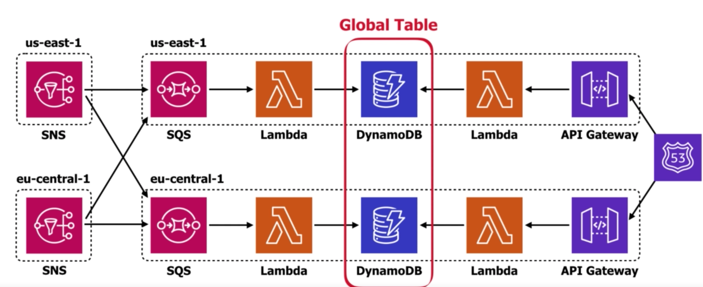
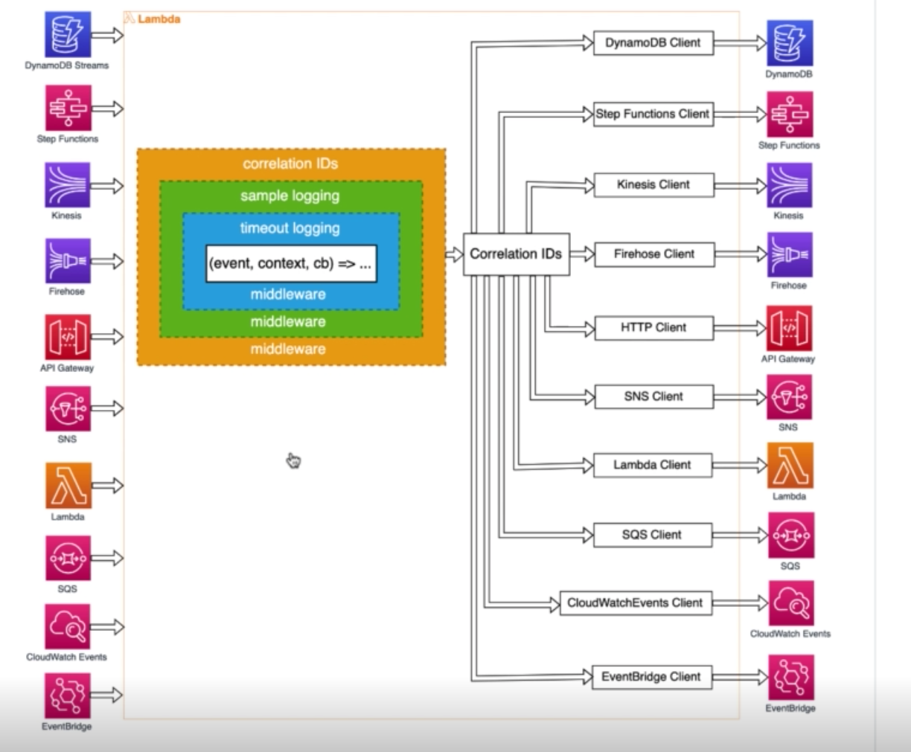
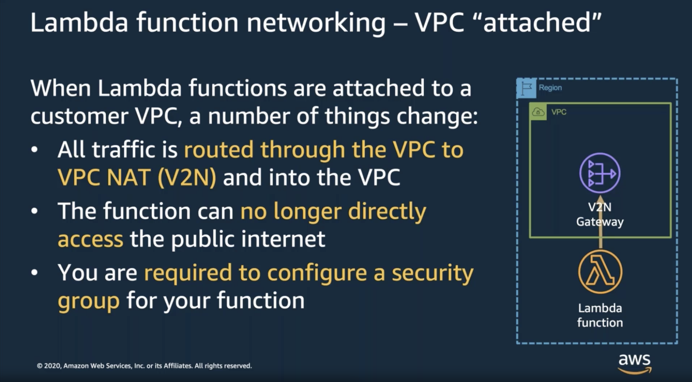

# Lambda

There is a difference between `exports =` and `module.exports =`. **Always prefer `module.exports` because it's the `module.exports` that gets returned**.
With `exports` you are mutating an `module.exports` and if there is an `exports` and `module.exports` within the same file, it's the `module.exports` that will be honoured.

## Invocation modes

- there are 2 invocation modes for any lambda function: _request response_ and the _event_ model

- the _request response_ model directly passes the event to the execution environment

- the _event_ model passes the payload to the internal SQS queue which is then consumed by _Lambda poller fleet_ and then passed to the execution environment

### Execution environment

- this is a worker running on EC2

- the execution environment is **reused per function version**, **not alias**

- given execution environment can be reused. It will be "alive" up to 8 hrs

## Lambda extensions

- scripts or binaries that run alongside your lambda function

- see the [extensions docs](./lambda-extensions.md) for more info

- the **GO 1.x does not support lambda extensions**, you have to use either **`provided` or `provided.al2` for the extensions to work**

## Lambda runtime

- wrapper the AWS provides that runs your handler.

- in **Node.Js, your handler is wrapped with `try/catch` so the 'uncaughtException` and similar handlers will not fire!**.

- if you have to dive really deep, the runtime you are using might be published on GitHub. At least that is the case for [Node.Js one](https://github.com/aws/aws-lambda-nodejs-runtime-interface-client) and many others.

### Custom runtime

What if your favorite way of writing lambdas is by using bash? Or maybe you want to do some funky stuff before your handler runs? All of this is possible with _custom runtimes_.

### Custom runtime and Lambda Runtime API

- they are like a middleman between _AWS Lambda Runtime API_ and your handler. The Runtime API exposes an HTTP API that the runtime can use.

- events that the runtime pooled are forwarded to your handler.

- for the go1.x runtime, there seems to be a proprietary mechanism of handling invocations.
  That runtime does not use the runtime API. Instead the connection is accepted on a localhost with port specified by the `_LAMBDA_SERVER_PORT` environment variable.

- the `aws-lambda-go` package constructs two clients, one for the "legacy" runtime and one for the one that supports Runtime API.
  After that, given client is run based on what kind of environment variable is specified.

- the _AWS Lambda Runtime API_ can be emulated. There exists an [aws-lambda-runtime-interface-emulator](https://github.com/aws/aws-lambda-runtime-interface-emulator) - an universal tool for emulating the Runtime API. You can also use `sam local invoke` command to streamline this process.

- the language specific runtimes already have RIE built-in for local testing.

- remember that RIE has to start before your runtime starts, thus you have to point RIE at a binary (or script). RIE will handle bootstrapping that binary.

## Tuning function memory

- the more memory your lambda has and the longer is runs it will cost you more

- memory allocation also controls CPU allocation

### Power tuning

- use **aws lambda power tuning tool** to see memory vs cost for your function

- use **lumigo-cli** to make your life easier. This tool is a collection of utility tools for AWS and also includes the aforementioned _power tuning tool_

- within **lumigo-cli** you can set different profiles and visualize results, for example:

  > lumigo-cli powertune-lambda -n io-bound-example -r eu-central-1 -s speed

### AWS Compute Optimizer

- this is an **complementary** service to the **power tuning** one.

- **compute optimizer looks at the actual load** while the **power tuning tools creates artificial load**

## Cold Start

- there are 2 factors that pay a role when it comes to cold starts: **duration** and **frequency**. You should mainly **focus on duration** since **frequency is usually out of your control**.

- look for **init duration** within **cloud watch logs** or an **initialization segment** within **XRay**.
  If there is an `init duration` field within the `REPORT` section, the invocation was a cold start.

- previous methods were only for a single function on a single invocation resolution. **Use lumigo-cli to see cold starts for all your functions on all your invocations**.

  > lumigo-cli analyze-cold-starts

- there are **2 versions of cold start**

  - If we are dealing with **new code being deployed**, the cold start will be **relatively long**
  - If we are dealing with **env update**, the cold start will be **relatively short**

- according to [this article](https://dev.to/kylehigginson/analysing-cold-starts-on-node-lambda-3i05) the biggest contributor to the cold start is the AWS Lambda package size
  - makes sense if you think about it

### Initialization time

- **adding more memory (thus CPU) WILL NOT AFFECT THE SPEED OF THE INITIALIZATION**. This is because lambda is run at full power, always, at initialization.

- it's **always faster** to load **dependencies from a layer**

- **unused dependencies** are **irreverent when it comes to initialization**

- only require what explicitly need

### Measuring cold start performance

- you can simply invoke your function

- to **force cold start** you can just **change / add env variable**

- use **lumigo-cli** to **measure particular lambda cold starts**
  > lumigo-cli measure-lambda-cold-starts -r eu-central-1 -n io-bound-example -i 100

### Improving cold starts with Node.js

- put stuff into `dev-dependencies`. This is quite dangerous since the version can change. As an alternative **publish lambda-sdk as lambda layer**.

- only require what you need

- use `webpack` to bundle your dependencies

## Caching

- You can either cache **in-memory (per container) or globally (using some sort of cache service)**.

- Keep in mind that **if the resource you cache can change, you should refresh it on an internal basis**.

  - That **interval** should be **global and relative to a current time, not local**. If the interval is local (relative to the container), you risk some of your functions running with an outdated value.

  - To cache **per global interval, use date functions and not hardcoded timestamps**.

  - You can learn [more about caching relative to global time here](https://www.webiny.com/blog/aws-lambda-time-based-caching-technique).

## Layers

- use `Lambda layers` to abstract common logic.

- these can be anything that you want to get into execution environment, literally, for all lambda cares it could be a binary file.

- layers are versioned automatically, you can reference up to 5 layers.

- when working with `node.js` you will have to set `NODE_PATH` environment variable:

  ```yml
  NODE_PATH: "./:/opt/node_modules"
  ```

  this is so that you can use both the root `node_modules` and the ones defined within your layers. A good explanation of `NODE_PATH`:

  > NODE_PATH is like the windows path environment variable. Whenever node can't find a file, it looks through the paths in the paths stored in the NODE_PATH variable.

## Provisioned Concurrency

- you cannot use it on `$Latest`

- makes it so there are X containers within your function, warm, ready for execution

- this means that you can have functions which are not handled by provisioned concurrency.

- there is one **gotcha that might throw you off**. When you invoke your function **it will still report old `Init Duration`**. This is due to the fact that **the reported `Init Duration` happens at the time the concurrency is provisioned**.

- you can have **alias pointing to version which has provisioned concurrency enabled**, but always remember that **provisioned concurrency is always assigned to version**

### When to use Provisioned Concurrency

- for really strict latency requirements

- for spikes of traffic

- when cold starts stack up (multiple sync lambda calls)

### Tips

- use **weighted distribution with alias** to make sure you do not loose provisioned concurrency executions when updating versions

- use **scheduled auto scaling** for spikes of traffic you know ahead of time.

## Enabling HTTP keep-alive

This used to be the case where sdks for lambdas were not using `keep-alive` by default. This would result in having to establish a handshake with every request.

**That is no longer the case** and **both js and golang sdk have keep alive enabled by default**.

## Fan-out

You have `ventilator` that spits out work to multiple workers. Since lambda scales horizontally , it's an ideal candidate for a worker pool.

- for **low traffic** use **SQS / SNS / EventBridge**

- for **high traffic** use **Kinesis**

It's also important to understand how concurrency scales in regard to messages per second.

- `SNS` and `EventBridge` scale concurrency linearly, that means there is **no batching**

- `SQS` **has batching** which means that the scaling for more gradual

- `Kinesis` scales more aggressively than `SQS` since your can have batching on `ShardID` level, but still not as aggressively as `SNS` or `EventBridge`

## Controlling Concurrency

This concept is quite important since having no control over concurrency can be a problem to your downstream system.

- with `Kinesis` the flood of messages can be amortized by the ability to hold messages for up to 7 days.

- `SNS / EventBridge` can be a bit problematic. There are retry mechanism in place, but what if they fail?. Remember that `SNS` wait for the acknowledge message for 15s, otherwise will consider given message as a failure in delivery. You can always rely on `dead-letter queue`

There might a problem with `Kinesis` where one _poison message_ can really screw you up, being delivered over and over to your lambda function. You can control this behavior though using `on-failure destination` and `maximum age of record`.

## Service Proxy

This is where you bypass compute layer (your lambda) and go directly to a service. The example here would be going to eg. DynamoDB directly.

You **should consider** using **service proxies** when you are **concerned about cold start overhead or a burst limit of lambda**.

This solution is not without downsides though:

- you loose exponential backoff and retries (SDK is doing that for you)

- you loose logging

- you loose the ability to use 3rd party tracing tools

- you loose the ability for having custom error handling logic

- **VTL is hard to test / write**

## Load testing

- model your load test to resemble the actual traffic. Do not create artificially steep concurrency curve.

- use user stories for testing. Do not hammer a specific endpoint. By doing that you are testing the AWS and not your service.

- artillery.io can be helpful. As an alternative you should look into `serverless-artillery`

## Handling RDS connections

- default config for RDS is just bad for lambda.

- use **RDS Proxy**.

## Lambda Destinations

- works only for **async / stream based invocations**. The **pool based invocations are NOT ASYNC!**.

- since the feature does not work for _pool based invocations_ the Lambdas invoked by SQS or DDB Streams or Kinesis will not have destinations available to them.

- here is a helpful article that lists the Lambda invocation sources <https://aws.amazon.com/blogs/architecture/understanding-the-different-ways-to-invoke-lambda-functions/>

- gives you much more information than DLQ, even provides you the stack trace.

- prefer Lambda Destinations when you can.

- remember that Lambda Destinations are not only about failure. **There is also `onSuccess` event you can configure**. You would use it when you have `one hop` situation. Other than that **prefer step functions**.

## Async with Lambda

- Lambda async invoke: buffer is managed for you

- SQS event source to Lambda: you manage the buffer and DQL

- Stream event source to Lambda: you manage the buffer, each shard is like a FIFO queue. With Stream data there is a concept of **poison pill**. This is where you cannot, for some reason, process batch of requests and due to this, you cannot make any progress.

## Event Source Mapping

- A **Lambda resource** that **reads** from an **event source** and then **invokes** the Lambda function

- One might **specify filters** on the **level of Event Source Mapping**

  - Remember struggling with DynamoDB streams filtering inside AWS Lambda? That is no longer the case. You can specify a filter on ESM and have your lambda be invoked only when necessary

- Remember that **ESM is used** only with **services that Lambda reads events from**.

  - DynamoDB
  - Kinesis
  - MQ
  - SQS
  - Kafka

- You can **configure destinations on the Event Source Mapping**. Pretty neat!

- The **Event Source Mapping invokes** your function **synchronously**. This is so that **the ESM can determine if your function failed or not**.
  - If your function failed, the event batch might be split (depending on your configuration)

## Secret Management

### Storage

- there are 2 services which you should look at: `SSM Parameters Store` and `Secrets Manager`.

- `SSM Parameter Store` is mostly free, unless you want to use `advanced parameters` (larger payload).

- remember that `Secrets Manager` can **rotate credentials**. That is **applicable even for RDS credentials**.

### Distribution

- remember to **never store secrets as env variables within your function**.

- you should **fetch secrets at runtime**, cache and invalidate the cache every few minutes.

- if you are writing JS lambda, consider using `middy`. It is a great tool - easy to use, gets the job done!.

## APIGW Throttling gotcha

If you create your API with a default settings, each stage has the default `10k` req/s throttling limit. This is an **region wide limit!**.
This means that I as an attacker only need to **attack your 1 endpoint to take down all your APIS within a given region**.

Pretty bad huh?

- always use custom throttling limits

- consider using `serverless-api-gateway-throttling` plugin if you are working with `serverless-framework`.

- if you are using `AWS SAM` you can set the desired throttling on the `AWS::Serverless::Api` type.

Read more [here](https://theburningmonk.com/2019/10/the-api-gateway-security-flaw-you-need-to-pay-attention-to/)

## Multi-region

- you can create SNS topics in multiple regions and have 1 SQS subscribe to these topics. This can cause duplication though, watch out!

- there is a term `static stability`. This is where a system would continue to work even if a region failed.



## Partial Failures

- by default `Kinesis` will **retry until success**. This is no good. Luckily AWS introduced payload splitting and DLQ.

- SQS **fails the whole batch**. This is probably not what you want. You could:
  - set `batchSize:1`. This is bad for throughput.
  - have idempotent workflow so that you can process multiple messages multiple times
  - call `deleteMessage` yourself for the successful messages. This way they will not get retried. After that, you can safely return an error.

## Alarms

- one alaram should monitor different failure modes

- use alarams to tell if something is wrong, not what.

Notable alarms are:

- `concurrent exectuions`: about 80% of the regional limit
- `IteratorAge`: for `Kinesis`.
- `DeadLetterErrors`: for async lambda invocations. **You should have deadletter queue setup, even better use lambda destinations**.
- `Throttles`: self explanatory

## Logging

- use simple `os.Stdout`. Logs are written to `CloudWatch` logs asynchronously.

- there is a **cost of ingestion** when using `CloudWatch` logs.

- use **sampling** to **log only a part (given %) of given log level**.

- if you really need it, you can stream logs to a 3rd party service like logz.io

### Flushing logs when an error occurred

- sampling is nice, but what happens if an error occurs and the log trace was lost due to sampling?

- use a **wrapper to flush all logs which are in-memory when an error occurred in your lambda function**

- [this article demonstrates the idea](https://dev.to/tlaue/keep-your-cloudwatch-bill-under-control-when-running-aws-lambda-at-scale-3o40?utm_source=newsletter&utm_medium=email&utm_content=offbynone&utm_campaign=Off-by-none%3A%20Issue%20%23126)

## Distributed tracing

### `X-Ray`

- you should strongly consider using `xray-core` only.

- `X-Ray` is not that good. Your traces will be cut after publishing to `SQS` or `EventBridge`. You will have to then use different filter to find those. Weird.

- `service map` view suffers from the same problem. You no longer have to jump in between filters, but still the dots are _not connected_ if you will.

- some _flow arrows_ are even missing, WOW! (apigw => lambda => back to apigw).

- **`ServiceLens`** gives you different view (look inside CloudWatch section). Still not great, **it does not event support most of the services**.

- one huge benefit of `X-Ray` is that the traces are saved _asynchronously_.

### `Lumigo`

- specialized service, seems better than `X-Ray`.

- no code changes required, you need to install serverless-plugin

### `Epsagon`

- specialized service, UI not that nice as `Lumigo`.

- a bit better capturing than `Lumigo`.

### `Thundra`

- you need to wrap lambda handlers with the `thundra` client.

- not that good reporting as `Epsagon` and `Lumigo`.

## Correlation IDS

- used to make sense of our logs.

- are used to **keep track of a origin request, when there is a lot of services involved in the chain**.

- this is very **useful with `Logs Insights`**. You can create simple filter:

  ```
  fields @timestamp, `x-correlation-id`
  | filter `x-correlation-id` = 'REQUEST_ID'
  ```



## Lambda powertools (node.js)

- multiple _middlewares_ for your lambda functions

- pretty nice packages, help you with `correlaction ids`.

- sampling is done at _transaction_ level, not at single invocation level.

## Cost

- use **AWS Billing** and `tags`!

- use **Cost Explorer** for very detailed graphs.

- **rightsize your lambda invocations!**.

- use `Step Functions` only for **core business workflows**. They are expensive!. You could also use `Express workflows`.

- CloudWatch charges per dimension!. **DO NOT USE REQUEST_ID AS DIMENSION!**.

- `NAT Gateway` can be **very expensive**.

- use **sampling of logs**.

- set _retention period_ on `CloudWatch logs`.

- `Lambda` is likely the cheapest part of your infrastructure. use `HTTP APIs` whenever you can.

- in **high thruput scenarios ALB is much cheaper than APIGW REST and HTTP APIs**.

## Orchestration vs Choreography

- two concepts of building services and how these services communicate with each other

### Orchestration

- think **step functions**

- step functions **control the steps of the workflow**. Probably **invoke lambdas**

### Choreography

- think **events**

- you will probably use **EventBridge** here. This is where everything is loosely coupled, there is **no central piece which orchestrates the functions**.

## Security

- **function policy**: think **what other service can invoke my function**. The **function policy** is **also called resource policy**.
  You would grant permissions to APIGW to invoke your function using this type of policy

- **execution role**: think **what can this lambda do**. You would grant permissions for your lambda to eg. talk to DDB here.

## Networking

### VPC

- **lambda does not LIVE INSIDE or IS INSIDE the VPC**.

- lambda is **attached to a internal NAT** that **lives inside your vpc**.



- this is **why the VPC cold starts are no longer an issue**. It's because the **v2n gateway is created at create/update time** of given lambda.

- _v2ns_ **cannot be put inside public subnet**. This is why **you will net NATGW + IGW when you want your lambda to have internet access**

#### Best practices

- **specify multiple subnets** when you attach your lambda to a VPC.

- use _Private Link_ for connecting to private services or other AWS services through _gateway_ or _interface_ endpoints

## Idempotency

The world would be better if we did not have to worry about idempotency, but here we are. In some applications, it does not matter (when looking at the problem via the pragmatic lens), but in others, it certainly does.

You solve the problem by deriving the so-called _idempotency key_ from the available data when the Lambda function is invoked. You can derive it from the event body, request headers, or other " fresh " data per Lambda function invocation.

Then, you persist with that token. It could be DynamoDB, Elastic Cache, or in-memory storage (if you got for the in-memory storage route, remember about the **Lambda container lifecycle**).

When, during each invocation, you pull that idempotency key, check if it is there. If not, you create one and save it. If it is, you return the result saved when you created the idempotency key. Remember that **when the user issues a duplicate request, it would be ideal to respond as if the request was successful but not take any action**. That is why we should also save the response along with the idempotency key.

That is the basic idea. But as we all know, things are usually more complicated than they initially seem. Ensuring your Lambda function is idempotent is no exception. Let us look at some of the edge cases next.

### Data accumulation

Depending on the number of incoming requests, saving an _idempotency token_ for each request could be costly. You first have to incur the costs of retrieving and writing it into the database, then the storage cost.

We cannot do anything about the reading and writing part. These costs are "fixed". But, we can do something about the storage costs – **have some way of deleting old _idempotency tokens_**.

A **common approach** I saw was the **DynamoDB TTL feature**. It works great, but you must remember that **DynamoDB TTL cannot be used for time-sensitive use-cases**. The **documentation mentions that the item WILL be deleted in a span of 48hrs and NOT when a timestamp is considered "old"**.

To make sure you have your cake and eat it too, **perform a conditional GET on the TTL attribute**. This way, you will never fetch stale _idempotency tokens_ while also reaping the benefit of the auto-cleanup capabilities of DynamoDB.

### Same request, different action

Consider a case where you want to buy a pair of t-shirts. You forgot to increment the count in the shopping cart and bought only one. You quickly make another request to buy a second. The t-shirt is the same, so you performed the same request from the backend's perspective (we do not account for any time-related properties here).

If this case is not considered, the idempotency mechanism might kick in, resulting in a noop request and the response from the previous request returned to you. That would be pretty bad – you would have a false sense that you have ordered the right amount of t-shirts.

That is why you **should NOT base your idempotency key solely on the incoming data** or you should **invalidate a given idempotency key after a short time**. If you were to ask me for a preference, I would say the first option is the best one. The client would send a **_client token_ along with the request**. That **_client token_ could then be used as a "seed" for the _idempotency token_**.

This way, when the client sends the same payload but with a different _client token_, we can treat it as a separate request, even if it happens right after we have created and persisted the _idempotency token_ for the first request.

### Locking

Imagine a situation where you invoke the same AWS Lambda function with the same parameters quickly. So quickly that the first invocation did not manage to finish by the time you performed the second one.

From the idempotency standpoint, the requests are the same, so ideally, we would process only one request and then return with a response immediately for the second. But that is impossible since we might not have the result from the first invocation when the second one is inbound.

As such, we have a problem – we can process the second request independently from the first one, causing the downstream to process the same payload twice, or **we can return an error from the second request, allowing the first one to finish**.

Since, in this case, correctness is more important than speed, we will most likely pick the latter. And to know that some other request is in-flight, we could **leverage locking mechanism on some attribute**. In the DynamoDBs case, that would mean **first saving a record indicating that the work for a given _idempotency token_ is in progress**, then **releasing the lock when the work is done**.

[AWS Powertools for Python](https://awslabs.github.io/aws-lambda-powertools-python/latest/utilities/idempotency/#handling-concurrent-executions-with-the-same-payload) and [AWS Powertools for Java](https://awslabs.github.io/aws-lambda-powertools-java/utilities/idempotency/#handling-concurrent-executions-with-the-same-payload) use the approach I've described above. What is great about it is that you can safely retry the operation when the system raises the "operation in progress elsewhere" exception.

### Idempotency when a service fails

Depending on the invocation method (either synchronous or asynchronous), your Lambda function might get executed multiple times. By default, for **asynchronous events** if the Lambda function fails, the service will **retry two times** before giving up. For **stream-based invocations**, the amount of retries **depends on the data expiry or your configuration**.

Either way, you should keep the characteristics I've listed above in mind while adding idempotency to your service. Do not be surprised when your AWS Lambda is re-executed.

### Idempotency and errors

When using the locking technique, it is **crucial to make sure that we do not have orphaned locks**. If we do, we risk denying the customer of our API to perform a given request (the subsequent request will fail at the "check if I can acquire a lock" step).

To ensure we do not have orphaned locks, we **have to delete any lock-related entries when an unexpected error happens within the code that should be idempotent**. You can do this in multiple ways – by an asynchronous process that runs on a schedule or directly in the AWS Lambda function. What matters is that you keep this edge case in mind.

Remember, **the more code you have in your "this should be idempotent" function, the bigger the chance for an exception or a bug**. That is why **you should keep your idempotent operations very granular** – like reaching out to 3rd party API or saving to a database. Do **NOT include validation or other compute as part of the idempotent operation flow**.

The last thing you want is for 3rd party API call to succeed, only for other instructions to fail, triggering the deletion of the lock.

### Additional reading

- [AWS Compute article](https://aws.amazon.com/blogs/compute/handling-lambda-functions-idempotency-with-aws-lambda-powertools/)
- [This article](https://adrianhesketh.com/2020/11/27/idempotency-and-once-only-processing-in-lambda-part-2)
- [This GitHub issue](https://github.com/awslabs/aws-lambda-powertools-roadmap/issues/28)
