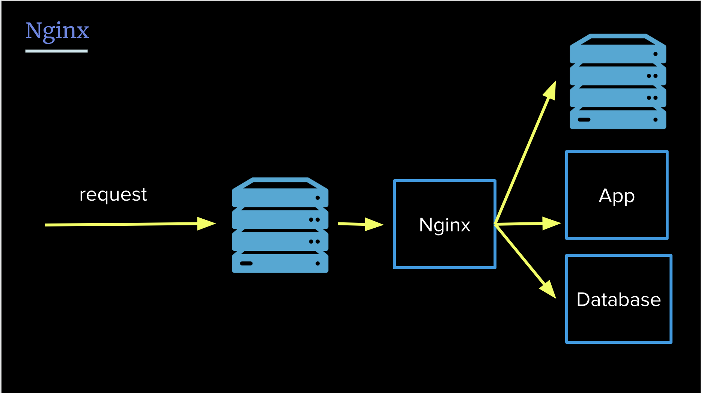
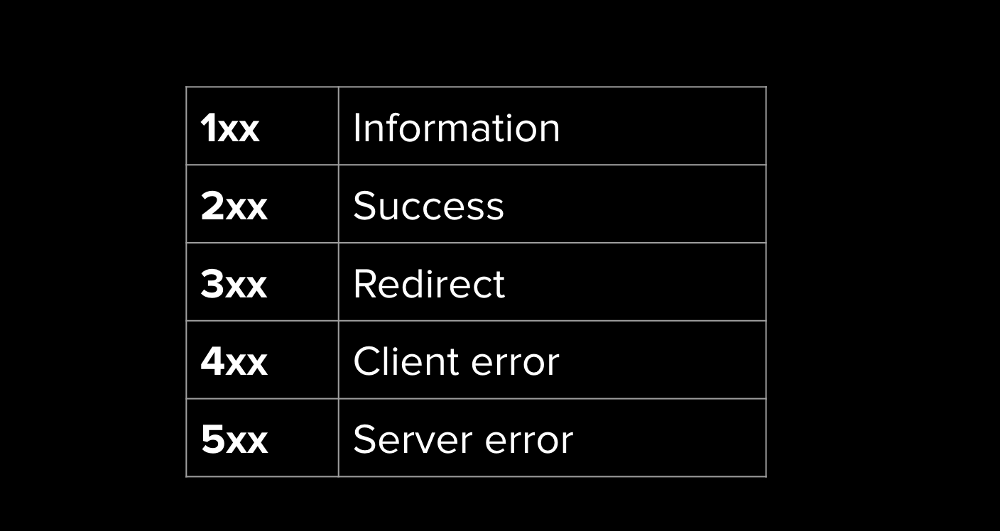

# Full Stack for Front-End Engineers

## Nginx (engine-x)

- reverse proxy
- web server
- proxy server

This is very popular web-server (similar to Apache). Nginx is extremely fast.

Nginx serves your html from (by default) `/var/www/html` directory. It uses

RegExp to resolve paths. Nginx also has something called `directives`. It just
like a macro to do stuff.

You can connect Nginx to many services, like Express. To achieve such connection
you usually need to use aforementioned `directives` (in this case something
called **proxy_pass**)

### Process Manager

You have a web server with Nginx and Express. Nice!

Now, what happens if you exit the shell? Everything stops. This is kinda meh
right? Would be nice if the server would keep running.

To do that we need **Process Manager**

- keeps you application running
- handles errors and restarts
- can handle logging and clustering

One such _Process Manager_ is: **PM2**.

### Redirects

So Nginx is not only proxy right? Well, we proxied `/` to an Express but we can
also config redirects directly inside Nginx config.

### 301 vs 302 Code redirects

- 301: permanent redirect
- 302: temporary redirect (like authentication with google, or your site is
  down)

Ok so this matters because google search bots distinguish between those codes
(and index based off that).

### Compression

So Nginx does the compression on the fly. (_g-zip_ compression). Bare in mind
that images are usually not compressed, because, well, most of the image formats
are already compression formats.

## HTTP (Hypertext Transport Protocol)

- thing that carries our code from server to client
- **it works over TCP**

With `TCP`, every single request needs a _hand-shake_. That is really
cumbersome.

### Headers

So packets are made of **data and meta-data**. Part of that _meta-data_ are the
headers.

There are many headers values, refer to MDN.

Some values of the headers are un-modifiable (you cannot for example change
`host` key)

#### User-Agent

Identifies given browser. Nowadays it's just mess, mainly because of older
times.

### Status Code

- indicates the status of HTTP request

So this is needed so that browsers know what to do with given response.

Pretty easy to remember!

## HTTPS

- encrypts all data traffic

With base HTTP you could not really be sure who you are "talking" to.

### CertBot

Back in the day adding correct certificates was quite hard. Now you can use
_CertBot_. Consult the docs, they are pretty good!

## HTTP/2

Instead of multiple _hand-shakes_ we can **multiplex**.

That just means that **one connection is responsible for multiple requests**.

There is a limit of connections though, depends on the browser.

There is also limit of requests per connection.

## HTTP/3

So all previous iterators of HTTP run over _TCP_.

## Orchestration vs Dockerization

So there are these 2 layers:

- Orchestration layer
- Dockerization layer

### Dockerization

You are probably familiar with `Docker`. This tool is used to run given code in
the same environment for each developer / server so that there are no difference
in OS behavior and such. `Docker` lays inside the _dockerization layer_.

### Orchestration

Rolling our software sometimes can be similar to an orchestra playing. Each part
has to work so that the final product works.

One main piece of software that is responsible for said rolling our is called
`Kubernetes` (`K8s` in short). `Kubernetes` controls the process of rolling out
of all these containers you have.

## Load balancers

- Routes traffic to appropriate server cluster.

Normally you do not really have that much control over traffic to your servers.
Presumably your users will get routed to a given region and there are your
servers but still there is a problem which server to pick right?

Load balancers job is to **choose the most optimal server for given connection
for particular time to route to by a given connection**.
