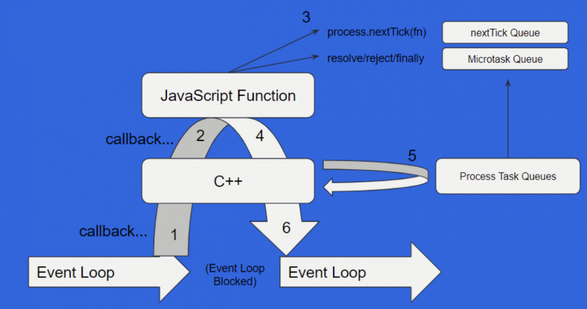

# Advanced node

Course material from [node university](https://node.university/).

## How does `require` work

- Imports given module

* There is **require cache**. That means that **module will be imported only once**

- The **cache is based on all imports within a program**

* Cache can be cleared

- The **`require` will actually execute the code in the file**

* If you **do not want the code to be executed** – **use `require.resolve`**
  You would use this method to check if a module exists. The **`require.resolve` also uses the cache mechanism**

- The `require` statement is **synchronous**. It uses `fs.readFileSync` under the hood.

  ```js
  // code
  if (cached && cached.source) {
    content = cached.source;
    cached.source = undefined;
  } else {
    content = fs.readFileSync(filename, "utf8");
  }
  // code
  ```

* Remember that each module is **wrapped within a function which exposes `__dirname`, `__filename`, `module`, `exports` to you**.
  This is why you do not have to import anything when you write `__dirname` within your module.

### `require` vs `import`

- The **`require` statement is dynamic**. That means that you can compute the final parameter.

* The **`import` statement is static**. While you cannot compute the module name, it's much better in terms of tree-shaking and dead code elimination.

### `require` cache

- You can delete cached imports

  ```js
  require("./module-4.js"); // execute code in the `module-4.js`
  delete require.cache[require.resolve("./module-4.js")];
  require("./module-4.js"); // execute code AGAIN since the item is not in the cache
  ```

## Globals

- Instead of `window` there is a `global` variable (sometimes you see it used while checking out Jest code)

## ESM

- you can opt into native ESM support by specifying `type: module` in your `package.json`

* the **most important thing to remember** is that **the globals from the CJS wrapper are thing of the past**.
  This means that `__filename` , `__dirname` and others are **gone**

- as an **alternative to CJS wrapper globals** consider using **`import.meta.XX`**

## The `v8` API

One neat trick I discovered with the v8 API is the fact that you can deeply clone an object without using the `JSON.stringify` stuff

```ts
function cloneDeep(values: Record<string, unknown>): Record<string, unknown> {
  return v8.deserialize(v8.serialize(values));
```

Look at this! So nice. Also much more readable. I bet that with the `JSON.stringify` you will get a question about what is going on.

## Event loop

> Taking notes while reading [this article](https://blog.frontend-almanac.com/event-loop-myths-and-reality).

- The _event loop_ is not regulated by JavaScript spec. **It is regulated by the `host`, the environment your code runs on**.

  - This means that, in theory, the _event loop_ might behave differently between the browser and Node.js deployments.

    - In reality, every server-side runtime depends on the `libuv` for the _event loop_ implementation so there are no differences in the functionality.

- The **[`libuv` mentions that the _event loop_ implementation is NOT thread safe](https://docs.libuv.org/en/v1.x/design.html#the-i-o-loop)**.

- The _event loop_ itself does not comprise of _microtasks_ and _tasks_ but rather from structures called a _microtask queue_ and _task queue_.

### Event loop and promises

It turns out you can block the event loop with promises. Yup, you've heard me right. And all of this is possible because how the promises interact with the event loop.

#### The native layer

Remember about all the Node.js queues that exist? The _macrotask queue_ and the _task queue_ and other queues? Turns out some of them - mainly the **microtask queue** and the **nextTick queue** are executed by so called _native layer_.

The _native layer_ is nothing more than the place where _libuv_ resides and executes. It's the **_native layer_ functions that drain the _microtask queue_ and the _nextTick queue_, not the Node.js event loop!**.

The _native layer_ **runs before the event loop starts**.

#### When does native layer run

The _native layer_ **runs in-between every event loop cycle**. When **_native layer_ runs, the event loop is BLOCKED**.
So if the _native layer_ can block the event loop, **it can happen that your promises block the event loop, since they are drained by the native layer**.

Here is an illustration that shows how the event loop interacts with the _native layer_.


#### Code example

To drive the point further, let us look at some code to make sure we understand how the _native layer_ operates.
Here is an, albeit very contrived, example of a sample Node.js program.

```js
new Promise((r) => {
  r();
})
  .then(() => {
    console.log("1");
  })
  .then(() => {
    console.log("2");
  })
  .then(() => {
    return new Promise((r) => setTimeout(r, 100));
  })
  .then(() => {
    console.log("3");
  });

setTimeout(() => {
  console.log("timer");
}, 0);

process.nextTick(() => {
  console.log("next tick");
});

setImmediate(() => {
  console.log("immediate");
});

console.log("regular code");
```

The goal is to guess what will be the order of the `console.log` statements. Please remember what we have talked about before. The **_native layer_ drains the microtask and nextTick queues in-between event loop cycles. This is a blocking process**.

The order of the log statements will be as follows

```shell
regular code
next tick
1
2
timer
immediate
3
```

1. The event loop starts, regular JS code is executed, thus first thing that is logged is the `regular code` log.
2. During the event loop cycle, the `new Promise` callback is executed because it's a synchronous call (**not completely sure here**)
3. During the event loop cycle, the `setTimeout` callback is scheduled to execute (timers queue) and the `setImmediate` is scheduled do execute (check phase, _immediate queue_)
4. The _native layer_ gets to work. The `nextTick` callback and two `then` callbacks are executed. **During this time, the _event loop_ is blocked**.
5. During this _native layer_ cycle, a `setTimeout` callback is scheduled to executed.
6. Control is yielded back to the event loop, since the _timers queue_ is run before the _immediate queue_, we see the `timer` log first, then the `setImmediate` callback is invoked
7. The _native layer_ gets to work, the last `then` callback is invoked.

#### More on promises

- the `Promise.resolve` and `foo()` (where `foo` is an async function) is basically the same

  ```js
  new Promise((r) => {
    console.log("synchronous resolve");
    r();
  });

  // same as above
  async function foo() {
    console.log("also");
  }
  foo();
  ```

- `nextTick` means **at the end of the current JS execution**. The `nextTick` callback does not execute during the event loop but in the _native layer_.

- the _native layer_ draining of queues can happen **multiple times per event loop tick**

- one key thing to understand is that **promises are executed synchronously and resolved asynchronously**. This is why code similar to

  ```js
  async function foo() {
    while (1) {}
  }
  ```

  will block

#### Error handling

Not handling errors correctly will result in **memory leaks** and problems with **file descriptors back-pressure problems**.

The biggest lesson here is to **not mix callbacks and promises**. There are many Node.js APIs which default form do not work natively with promises - like `eventEmitter` or similar.

##### Creating branches

Defining the `.then` and `.catch` callbacks on the promise object is like creating different branches. If you are not careful this might trip you up.

```js
const p = new Promise((_, reject) => {
  reject("boom");
});

p.then(console.log); // This branch is rejected, no error handler defined, thus an exception
p.catch(console.log); // This branch is rejected, error handler defined, thus the error is logged
```

You might think that since we have defined a `.catch` handler on the promise, we are safe. This is far from the reality as if you run this code, an exception will be thrown to the runtime. This is because **we have created 2 branches out of the promise object, only one of those branches handles errors**.

As an alternative, you could have used the `try / catch` construct. This is a safe way to ensure only 1 branch of execution is followed.

```js
const p = new Promise((_, reject) => {
  reject("boom");
});

try {
  await p;
} catch (e) {
  console.log(e);
}
```

#### Evaluation

You already know that the synchronous code within an `async` function is run synchronously. Remember though that **promises are resolved asynchronously**. This means that even though you might thrown an error within the `async` function, the status of the promise will still be `pending` till it's resolved.

```js
async function doRequest() {
  throw new Error("boom");
}

function foo() {
  const p = doRequest().then(() => console.log("works"));
  // p is in `pending` state here, not `rejected`
  return p;
}

// Without the `catch` callback defined, the error would have been forwarded to the runtime.
foo().catch(console.log);
```

## Gotcha with `Promise.race`

There are a lot of tutorials on the subject of `Promise.race` and how it can be used to create a "timeout" behavior.

A lot of those articles neglect one important detail that might cause a memory leak in your application.

The detail I'm referring to is that you **should always clear any timeouts you have defined after `Promise.race` returns**.

Here is a **bad example** from a blog post I've read recently.

```js
// Create a promise that rejects after
// `timeout` milliseconds
const throwOnTimeout = (timeout) => new Promise((_, reject) => setTimeout(() => reject(new Error("Timeout")), timeout));

const fetchWithTimeout = (url, options = {}) => {
  const { timeout, ...remainingOptions } = options;
  // if the timeout option is specified, race the
  // fetch call
  if (timeout) {
    return Promise.race([fetch(url, remainingOptions), throwOnTimeout(timeout)]);
  }
  return fetch(url, remainingOptions);
};
```

Notice that neither `fetchWithTimeout` nor `throwOnTimeout` attempts to clear the timeout defined in `throwOnTimeout`. So what will happen if the `fetch` is faster than the timeout?

Well, first the good news - **if the `fetch` is faster than the `throwOnTimeout` you will get the `fetch` result**. It might seem like the promise defined in `throwOnTimeout` was ignored. Sadly this is not the case – this bring me to the bad news.

The bad news is that **unless you explicitly cancel the timeout defined in `throwOnTimeout` the `setTimeout` callback will be executed regardless of the state of `fetch`**. Usually this is not a big deal. But in some cases some resources might be allocated in that callback. In such situation a memory leak is likely to occur.

### Using the `AbortSignal` API

The `Promise.race` API can lead to memory leaks if not implemented properly. Luckily for us, we can use `AbortSignal` in Node to ensure no memory leak occurs whenever a given promise rejects or completes.

The following is the code that implements a _race_ between a timeout and the request and utilizes the `AbortSignal` API to ensure that no memory leaks can occur.

```js
const { setTimeout } = require("timers/promises");

const makeRequest = async ({ signal }) => {
  // Makes the request...
};

const cancelTask = new AbortController();
const cancelTimeout = new AbortController();

const timeout = async () => {
  try {
    await setTimeout(1000, undefined, { signal: cancelTimeout.signal });
    cancelTask.abort();
  } catch {
    return;
  }
};

const task = async () => {
  try {
    await makeRequest({ signal: cancelTask.signal });
  } finally {
    cancelTimeout.abort();
  }
};

const main = async () => {
  Promise.race([timeout, task]);
};

main();
```

The **most crucial** thing to notice here is that the _task_ function cancels the _timeout_ function and vice-versa.

This ensures that no matter the outcome of the _race_, all resources are cleaned up, and nothing is left hanging (like the `setTimeout` callback in the previous example).

Please note that the `AbortSignal` API is available in Node 16+.

Consult [this article](https://www.nearform.com/blog/using-abortsignal-in-node-js/) for more information.

## Error handling and promises - the most important rules

The most important set of rules that you can follow are the following.

1. Always define a `catch` block at the end of the promise chain.
2. **Make sure to re-throw errors caught by the `catch` block if a promise will be dependent upon**.

Why is it important to re-throw the error?

```js
function foo() {
  return getItemFromDB()
    .them((item) => item.data)
    .catch((e) => {
      console.log(e);
    });
}

foo()
  .then((data) => {
    console.log(data);
  })
  .catch((e) => {
    // logic
  });
```

**If the do not return a rejected promise from the `catch` block, the `.then` handler on foo will be passed `undefined` value**.
This is not what we want right?

How to handle such situation?

```js
function foo() {
  return getItemFromDB()
    .them((item) => item.data)
    .catch((e) => {
      throw e;
    });
}

foo()
  .then((data) => {
    console.log(data);
  })
  .catch((e) => {
    // logic
  });
```

You can either return `Promise.reject` or re-throw the error. Now the program will be notified about the error coming from the `foo` function.

## Prefix-Only Core Modules

Have you ever used the core `fs` package? What about `node:fs`. Are these two imports different?

The `fs` and the `node:fs` are equivalent, and the latter represents the so-called _"Prefix-Only Core Module import"_. Why would Node.js maintainers bother having two ways of importing core modules?

The reason is naming and mainly userland vs. core package names. Historically, trying to introduce a new core package, one had to think about userland naming clashes. The whole process could take months due to negotiations with userland package creators.

With the `node:` prefix, this is not the case. Maintainers can freely introduce new packages without worrying about the naming clashes with the userland packages. What is more, having `node:` prefix makes it explicit that the package comes from Node.js core and not userland.

The new `node:test` module **will only be available via the prefix import**, which is a shift in a direction for the `node:` prefix import policy – all other modules work without the `node:` prefix. In my opinion, this is a good change and an excellent direction to take. The more explicit we are, the better.

You can read more about _"Prefix-Only Core Modules"_ in [this article](https://fusebit.io/blog/node-18-prefix-only-modules/?utm_source=ESnextNews.com)
