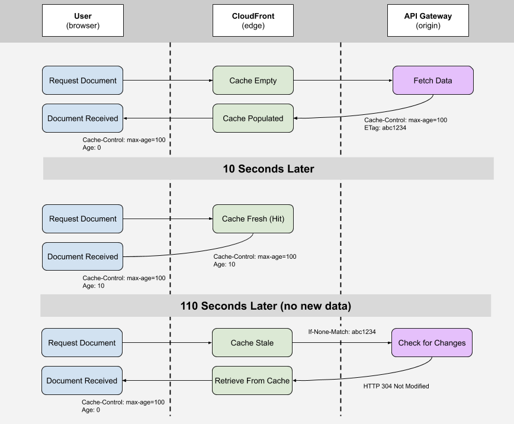

# Network

## The HTTP protocol

Notes [based on this video](https://www.youtube.com/watch?v=gxF9fLo5XQw).

### How web works

- You fire a request for web page through your browser.

- The browser requests an IP address from the DNS server.

  - There are a lot of intermediary steps here, but these are not that important.

- The browser will open a TCP connection with the server under a given IP address.

- The browser will request the `index.html` page.

- As the browser parses the HTML, the browser might request additional resources from the server (think media, stylesheets or scripts).

### What is the HTTP

- HTTP is a protocol, initially designed for transferring `.html` files over the internet.

- Nowadays it is used to transfer many other different documents and formats, even binary data.

### Evolution of the HTTP protocol

- The initial version of the HTTP protocol (0.9) only supported a `GET` methods and was very bare-bones.

- The **HTTP 1.0 introduced headers, `POST` and `OPTIONS` methods and response codes**.

- The HTTP 1.1 introduced new headers, better caching methods and **the `Connection: keep-alive` header also known as _persistent connections_**.

  - This helps when requesting multiple resources. The browser does not have to re-establish connections to the server all the time.

  - This behavior **is the default behavior for any HTTP 1.1 enabled servers**.

#### Problems with HTTP 1.x

- As websites grow in complexity, the amount of additional assets that the browser needs to download follows. **Since HTTP 1.x does not support parallel resource loading, this was a big problem**.

  - Some browsers would open multiple connections at the same time, but the number maximum number of connections the browser would open was pretty low.

    - But this is **not a silver bullet**. While `keep-alive` might help, the more connections you have to open, the bigger the overhead since we have to establish X unique connections.

- When sending the request, the **headers are not compressed**. This might seem insignificant, but **considering that the SCP headers are quite big, and the amount of requests the browser makes is rather large** this adds up.

- There is no prioritization of requests. This might lead to bandwidth congestion and throttling.

### The HTTP 2.0 solutions

- Works on the basis of **TCP streams**. This means that **multiple requests can be send via a single stream**.

  - This is called **multiplexing**.

  - This allowed for SSE events to be more useful. You are pretty much no longer limited in terms of amount of connections.

- The server can implement something called _server push_. It can update browser assets without the browser making any requests.

  - There is a risk of saturating the network if the server is not smart about when to use the _server push_.

- **Since the communication happens across multiple devices, it might happen that one of the devices the request is router through does not support HTTP 2.0**. This is something called _mixed mode_ and can cause overall slowdowns.

## The `fetchPriority`

The browser can make a lot of network requests when the user lands on the page. All the CSS / JavaScript and other asset has to be downloaded from somewhere. Each request has a priority (look it up in the network tab of the developer tools). **Developers can control the priority of the fetches via the _priority hints_**.

### Assets and links in HTML

One of the ways one can prioritize a network request is via many attributes that exist on the `a` tag.

- There is the `rel="preload"` attribute which tells the browser that the resource MUST be downloaded. As such the browser will issue a **high priority fetch for this resource**.

- There is `rel="prefetch"` which tells the browser to download a given resource for later. **The browser might ignore this request depending on various factors, one of which is network bandwidth**.

> There is also `async` and `defer` attributes which denote when browser is supposed to "parse" a given resource.

In addition to the `preload` and `prefetch` one can **use `fetchpriority` prop**. The `fetchpriority` prop overrides the default importance of the network request as computed by the browser. **`fetchpriority` is a hint not a directive**. This means that the browser might or might not respect the preference set by the developer.

You could, for example, use the `rel="preload` to start the fetch of the resource as soon as possible, but denote it as `fetchpriority="low"` to deprioritize it. [Check this article out for more information](https://web.dev/fetch-priority/#the-fetchpriority-attribute).

### In fetch requests

**By default** all the `fetch` requests are of high priority. You can **control the priority of the requests using the `priority` prop**. You might think that setting the `priority` to `low` for analytics-related fetches is a good idea. Why would it not be?

It is! but what will happen if you initialize the request and then switch pages? It turns out there is a high chance the request you have just made will be cancelled. This is **quite important** to understand since it has major implications – your backend might not receive all the requests.

**How can we deal wit the fact that the `fetch` requests might get cancelled?** We can use the `keepalive` prop!

The `keepalive` prop tells the browser **to carry the request to completion even when the page is terminated**.

#### `sendBeacon` alternative

This API was **specifically designed for sending analytics requests**. It combines the benefit of the `fetch` with `keepalive` and makes the request low priority. Here is how one could use it.

```js
document.addEventListener("visibilitychange", function logData() {
  if (document.visibilityState === "hidden") {
    navigator.sendBeacon("/log", analyticsData);
  }
});
```

But, **the API has its limitations**.

- You can only send a POST request. That is usually not the problem.

- **It does not natively support adding custom headers**. That is a much bigger problem, but there is a way out.

To add custom headers to the `sendBeacon` API call, one has to create a `Blob`.

```js
<a href="/some-other-page" id="link">Go to Page</a>

<script>
  document.getElementById('link').addEventListener('click', (e) => {
    const blob = new Blob([JSON.stringify({ some: "data" })], { type: 'application/json; charset=UTF-8' });
    navigator.sendBeacon('/log', blob));
  });
</script>
```

And there it is! Now you have both the semantics of the `keepalive` with low fetch priority and custom headers.

## Http Caching

While working with _React_ or other frameworks you might get caught up in thinking only about the _client side_ cache.
Libraries like _react-query_ and _apollo client_ make caching on the client easy.
But we can do more, we can cache our data on the _http_ layer as well.

### `max-age` header

There are many _http cache headers_ but this one is by far the most important one. This will **give a hint** to a browser on how **long should given object live in cache**.

Now, this is a hint, not a demand, not something authoritative. You might end up in a situation where that object will not be cleared at all, but more on that later. All you have to do is to set the header, here is an example in `nodejs`

```js
const http = require("http");

const server = http.createServer(function requestListener(request, response) {
  response.setHeader("content-type", "text/html");
  response.setHeader("cache-control", "max-age=10");
  response.writeHead(200);
  response.end("<div>works</div>");
});

server.listen(3000);
```

**Remember to enable browser cache and make sure you are not using hard reload**.

With this simple header we are able to cache some content for some period of time, after that time expires, **without any additional changes**, browser will request the resource again.

#### `max-age` on the CDN level

If you are doing any kind of _Static Site Generation_ you might have faced a problem where your customers are getting stale data even though you changed the content. This is probably because you set a high `max-age` header because your content is, well, static.

While having a high `max-age` for things that literally do not change is a good strategy, it will not necessarily work well with SSG. What you want to do is to set relatively short `max-age` on the browser level and a long `max-age` on the CDN level, where you have the ability to purge the content from the cache.

This way you basically have best of two worlds.

- Your content is cached so your visitors are getting the content in a fastly manner
- You have the ability to purge entry from CDN cache

To make it all work, you will need to use the `s-maxage` header. This is the header which only CDN understands, it allows you to difference between browser cache (`max-age`) and CDN cache (`s-maxage`).

The workflow you presumably look as follows

1. You build your static sites
2. You introduce a cache in the content to some of them
3. You purge existing entries in CDN which correspond to the pages you have changed
4. You deploy your changes

### `ETag` header

`ETag` header is there as a **mechanism to tell the browser that the content is still the same**. I think this image tells the whole story:



You can send whatever really, as long as you can determine if the content changed or not.
Browser will send you back the `If-None-Match` header after the `max-age` is expired.

If the `ETag` is different - you send the resource along with new set of headers, otherwise you just return with _304_ status code.

Here is the `nodejs` sample

```js
const http = require("http");

const server = http.createServer(function requestListener(request, response) {
  if (request.headers["if-none-match"] && request.headers["if-none-match"] === "1") {
    response.writeHead(304);
    response.end("");
  } else if (request.url === "/") {
    response.setHeader("content-type", "text/html");
    response.setHeader("ETag", "1");
    response.setHeader("cache-control", "max-age=10");
    response.writeHead(200);
    response.end("<div>works</div>");
  } else {
    response.setHeader("content-type", "text/html");
    response.end("<div>works2</div>");
  }
});

server.listen(3000);
```

So easy right? Now imagine what you can do with _GraphQL_ and other stuff.

### The only two cache-related headers you need

> In addition check [out this talk](https://www.youtube.com/watch?v=qVQjGwm_mmw).

- The **`cache-control` header** combines multiple headers together allowing you to specify a kind of _directive_ on how the file should be cached.

  ```txt
    cache-control: private, max-age=300, must-revalidate
  ```

- The `etag` allows you to revalidate a given file when the contents of that file changed. The value of the header is a hash of the file.

  ```txt
    etag: 123AAbbcc
  ```
